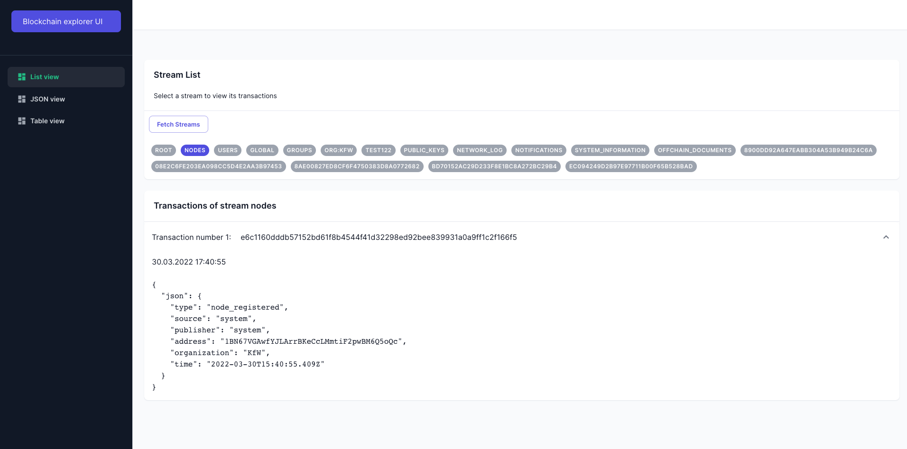
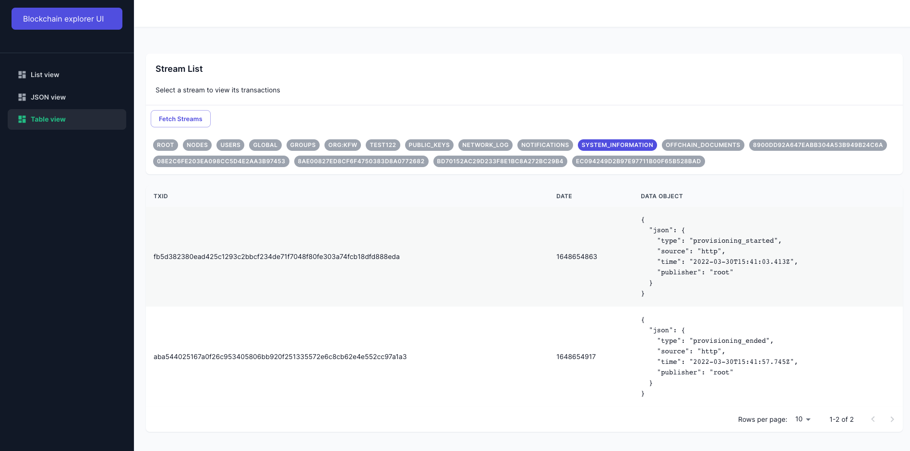
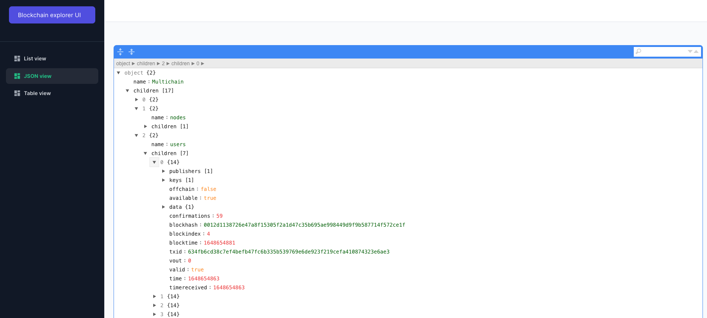

# Multichain explorer with ExpressJS and NextJS.

## Getting started

To run a demo version of this project, you need to run the Multichain, API and UI:

To start the multichain with mocked data in Docker, run `bash start-trubudget-multichain.sh`
To start the API, run `cd blockchain-explorer` and `npm run dev`
To start the API, run `cd explorer-ui` and `npm run dev`

## Features

The Blockchain Explorer allows you to view the Multichain data in three different modes:

- List View
- Table View
- JSON View

### Screenshots

#### List view

#### Table view

#### JSON view

