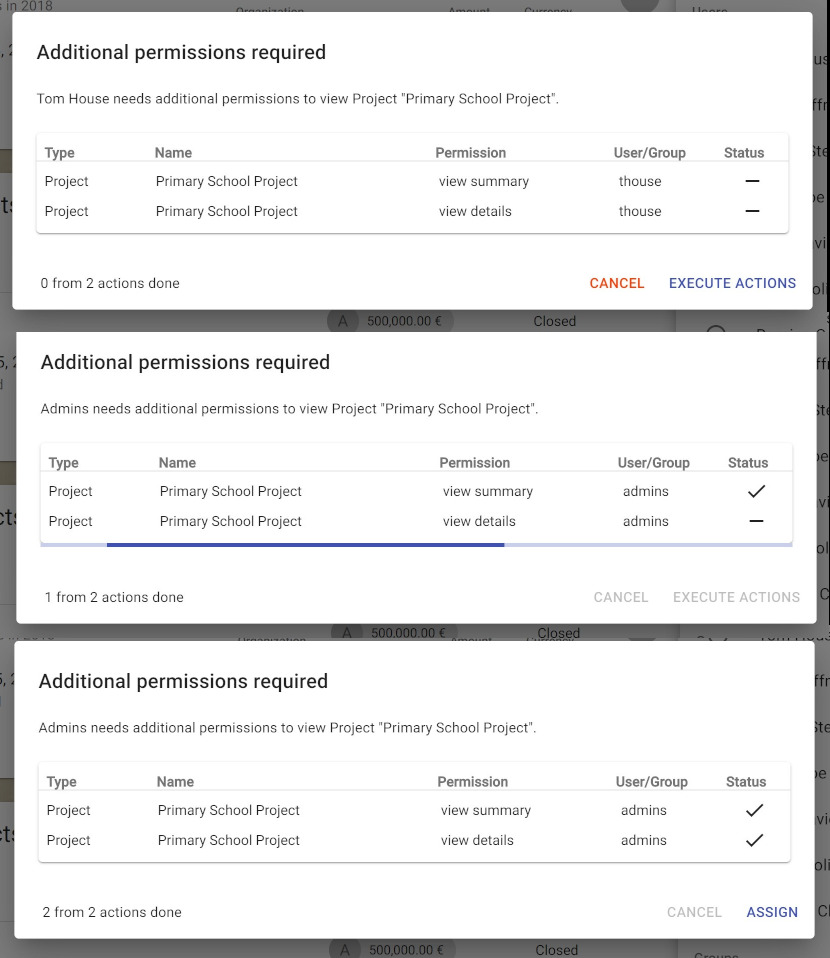
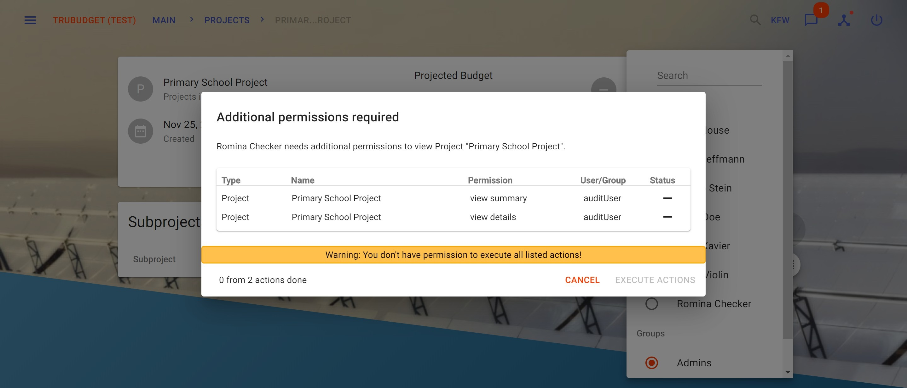

## Confirmation

If an intent is requested a confirmation should be required for every action in Trubudget avoiding mistakes made by acting too quickly. Since version 1.5.0 some intents require a confirmation before they are executed.

### Supported intents

Following intents needs confirmation before they can be executed:

- project.assign
- project.intent.grant
- project.intent.revoke
- subproject.assign
- subproject.intent.grant
- subproject.intent.revoke
- workflowitem.assign
- workflowitem.intent.revoke
- workflowitem.intent.grant

### Automatically grant view permissions

Trubudget has a complex permission system which often leads to misunderstandings when things are disabled because of missing permissions. The confirmation dialog shall help avoiding misunderstandings by granting required permissions automatically. If a confirmation is required, view permission checks are made to find out if the user involved needs additional permissions to view the item. In case of assigning a user it only make sense to assign a user if he/she can see the item he/she is assigned to.
Note that revoking permissions never grant/revoke additional permissions.

### Confirmation Dialog

A confirmation dialog can look differently depending on the permissions of users included in the process. These section describes all possible confirmation dialogs.

#### Dialog without actions

If the user has all required permissions and no additional actions have to be executed following dialog appears.

#### Dialog with actions list

If the user has all required permissions and additional actions have to be executed following dialog appears.

#### Dialog without view permissions

If the user misses view permissions on any resource involved following dialog appears.

#### Dialog without grant permissions

If the user misses grant permissions on any resource involved in all viewed additional actions following dialog appears.

