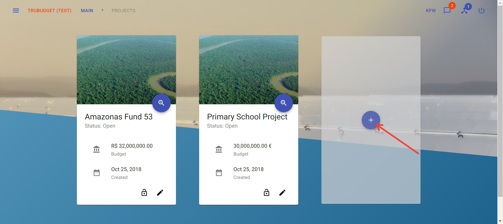
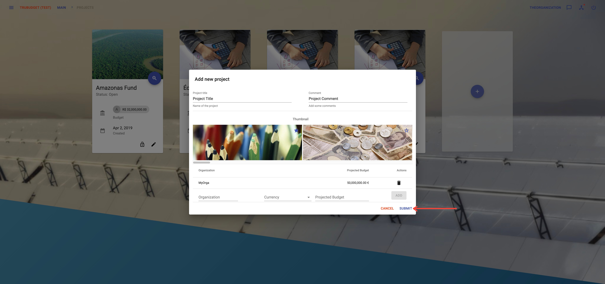
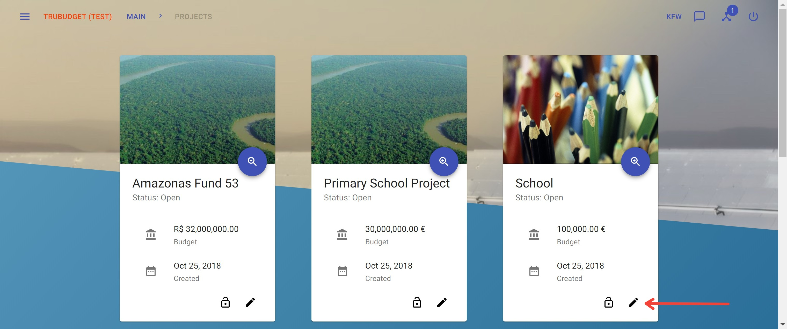
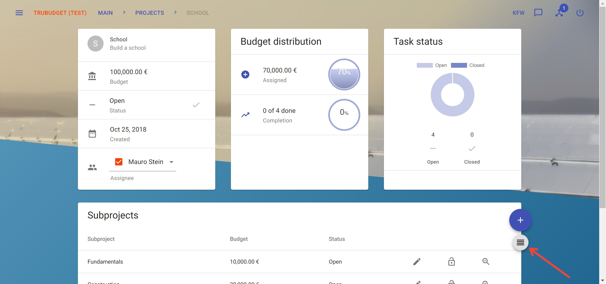
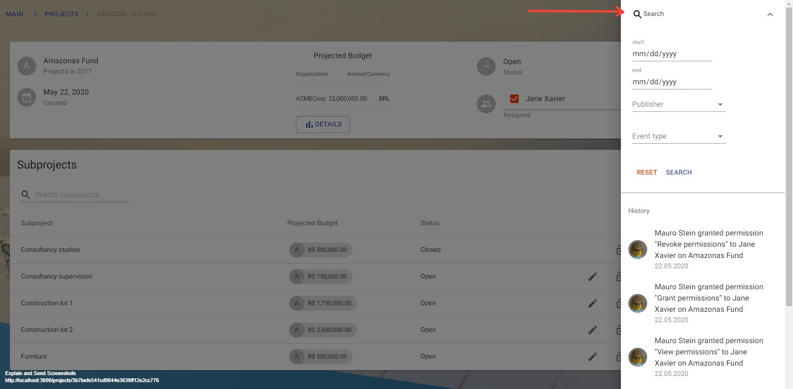

# Project

- [Project](#Project)
  - [View projects](#View-projects)
  - [Filter projects](#Filter-projects)
  - [View project details](#View-project-details)
  - [Create a project](#Create-a-project)
  - [Update a project](#Update-a-project)
  - [Assign an User/Group to a project](#Assign-an-UserGroup-to-a-project)
  - [Close project](#Close-project)
  - [View the history of a project](#View-the-history-of-a-project)
  - [Filter the history of a project](#Filter-the-history-of-a-project)
  - [Project tags](#Project-tags)
  - [Permissions on project](#Permissions-on-project)
  - [Create a subproject](#Create-a-subproject)

Projects are currently the highest layer of abstraction in TruBudget. They represent the overall intention of what you trying to achieve, like building a school in Malawi.

There are some different permissions which affect projects.

- project.viewSummary
- project.viewDetails
- project.assign
- project.update
- project.intent.listPermissions
- project.intent.grantPermission
- project.intent.revokePermission
- project.createSubproject
- project.viewHistory
- project.close

More details about the permission model can be found in the [Permissions section](../Permissions.md).

## View projects

**Description:**

View all projects where the current user has view-permissions on.

**Notes:**

- An alternative way to view the projects site is to click on the Main Button in the upper left corner.
- To view the project's details take a look at the [View project details section](#view-project-details) below.

**Instructions:**

1. Click the button in the upper left corner to open the side-navigation-bar
2. Click the "Projects" menu point

## Filter projects

**Description:**

There are 3 ways how projects can be filtered on the overview page:

1. Searchbar
2. Tag-Button
3. URL

The Searchbar can be used to search all projects for a term included in name, tag or status. These can also be used as prefixes to specify the search context (e.g. tag:mycustomtag). If no prefix is used display name, tag and status are searched for a match. After typing the project list and the URL are updated instantly. The URL can then be shared to other users including the filter.
The Tag-Button can be clicked to only show projects including the clicked tag.
The URL supports query parameters which are updated instantly when typing search terms into the searchbar.

**Notes:**

- Use prefixes to search specific attributes. Available Prefixes: tag, name, status
- The filter options can be easily shared by copying the link after typing in the search terms into the searchbar.

**Instructions:**

1. Navigate to the overview page
2. Click the "Quick Search" button on the top right
3. After the search bar appears, type in the term by which you want to filter the projects
4. The projects are now filtered by your search term
5. If you want to clear the search field, click on the "X" button next to the text

## View project details

**Description:**

View details like budget distribution or task status of a project.

**Notes:**

- The project.viewDetails permission does not permit to view any subproject.

**Instructions:**

1. Click the button in the upper left corner to open the side-navigation-bar
2. Click the "Projects" menu point
3. Click the blue magnifier icon in the bottom right corner of a project

## Create a project

**Description:**

Create a new project defining title, comment and budgets.

**Notes:**

- The root user may not create projects.
- Do not forget to permit other users to view/edit the newly created project.
- You have to add at least one budget before you can submit the project.
- To add a budget, the "+" button needs to be pressed. Only budgets that appear above the text field are saved to the blockchain.

**Instructions:**

1. Click the button in the upper left corner to open the side-navigation-bar
2. Click the "Projects" menu point
3. Click the '+' icon in the middle of the grey card next to the other projects if there are any

4. Fill in the required fields:

   - "Project Title": Title of the project
   - "Comment": A little description or comment refering to the project
   - "Organization": Organization that the budget belongs to
   - "Currency": The currency of the organization's budget
   - "Amount": The amount of the organization's budget

5. Add the budget of the organization by clicking the "+" symbol
   
   After this, the entered budget will appear on the screen
   

6. Change the thumbnail to a picture that fits best for your project

7. Click the "Submit"-button to create a new project.
   

## Update a project

**Description:**

Update details like title, currency, comment or budget amount of a project.

**Notes:**

- The pen icon can only be viewed if the current user has update permissions.
- The pen icon disappear if the project is closed

**Instructions:**

1. Click the button in the upper left corner to open the side-navigation-bar
2. Click the "Projects" menu point
3. Click the pen icon in the bottom right corner of a project

4. Fill in the fields that shall be updated:

   - "Project Title": Title of the project
   - "Comment": A little description or comment refering to the project
   - "Currency": Currency of the project
   - "Project budget amount": Assigned budget to the project

5. Change the thumbnail to a picture that fits best for your project

6. Click the "Submit"-button to update the project.

## Assign an User/Group to a project

**Description:**

Assign a User or Group to a project to show which User or Group is responsible for it.

**Notes:**

- Assigning a user/group needs project view permissions.
- If the assignee has not all necessary view permissions yet a dialog opens which shows all required permissions.
  On confirm they can be granted if the assigner has grant permissions. (see [confirmation](../Confirmation) for more Details)

**Instructions:**

1. Click the button in the upper left corner to open the side-navigation-bar
2. Click the "Projects" menu point
3. Click the blue magnifier icon in the bottom right corner of a project
4. Click the assignee dropdown field to open a selection
5. Select and click on an user or group to open a [confirmation dialog](../Confirmation)
6. In case the assigner has no project view permissions the user or group cannot be assigned
7. Confirming the dialog first executes all additional actions listed if there are any, then assigns the user
8. If no addtional permissions have to be granted the user or group is assigned

## Close project

**Description:**

Close a project when all subprojects are closed.

**Notes:**

- A project can only be closed if all subprojects are closed and the user has the project.close permission.

**Instructions:**

1. Click the button in the upper left corner to open the side-navigation-bar
2. Click the "Projects" menu point
3. Click the blue magnifier icon in the bottom right corner of a project
4. Click the done-button next to the status section to close the current project

## View the history of a project

**Description:**

The history contains all activities done directly refer to the current project.

**Notes:**

- The history of actions refer to workflowitems can only be viewed by the [history](../Projects/Subproject.md) of a certain subproject

**Instructions:**

1. Click the button in the upper left corner to open the side-navigation-bar
2. Click the "Projects" menu point
3. Click the blue magnifier icon in the bottom right corner of a project
4. Click the grey button below the '+' button on the right to open the right sidebar viewing the history of the current project.

## Filter the history of a project

**Description:**

The entries in the history can be filtered by 4 different values: publisher, type of event, a start date and an end date, where a timeframe can be determined. By clicking the search button, all values that are specified are used in the filter request.

**Instructions:**

1. Click the button in the upper left corner to open the side-navigation-bar
2. Click the "Projects" menu point
3. Click the blue magnifier icon in the bottom right corner of a project
4. Click the grey button below the '+' button on the right to open the right sidebar viewing the history of the current project
5. Click on the top of the sidebar to open the expandable filter area

## Project tags

**Notes:**

- Starting with v1.3.0, projects can have tags to add additional data to them, group them and make them searchable.
- Tags can be added when creating or editing the project, either via the UI or the API.
- Tags should not contain whitespaces or any special characters except "\_", "." or "-".
- Tags can contain alphanumeric characters and can be up to 15 characters.
- Tags cannot not start or end with the special characters listed above
- Tag-Buttons in the project list of the overview page can filter projects by tag

**Instructions:**

1. Click the button to add a new or edit an existing project
2. Type the tag name in the "Tag" field
3. Hit the "Enter" key or click the "Add" button next to the input field
4. The tag is now visible below the input field
5. [OPTIONAL] Hover click the "X" symbol next to the tag name to remove the tag
6. Click "Submit" to save the tags to the project
7. The tags are now visible on the overview page on the corresponding project card or on the project details page

## [Permissions on project](../Permissions.md)

## [Create a subproject](./Subproject.md)
