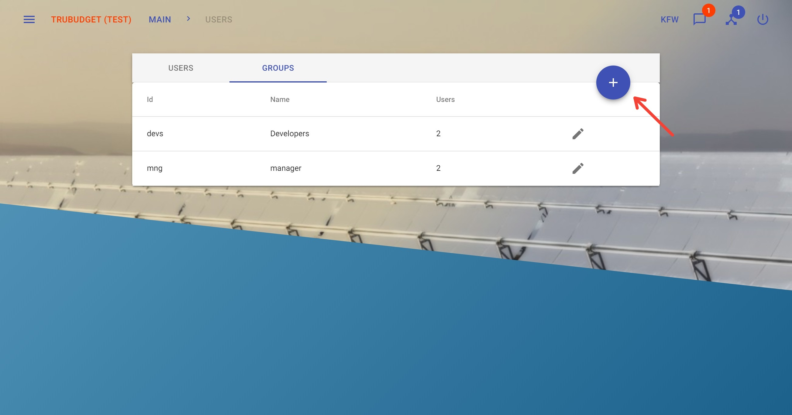

# Group

With groups you can manage permissions for a set of users at once.

## View Current Groups

**Description:**

View all groups the current user is member of.

**Notes:**

- If a user is added to a group recently, this user can view the group after next login not only by refreshing the page.

**Instructions:**

1. Click the button in the upper left corner to open the side-navigation-bar
2. The user's groups are displayed in the "Groups" section of the side-navigation-bar

## View All Groups

**Description:**

View all groups.

**Notes:**

- The list of available groups can only be viewed by administrators

**Instructions:**

1. Click the button in the upper left corner to open the side-navigation-bar
2. Click the "Users" menu point

3. Click the "Groups" tab on the Users page to display all available groups

## Create a Group

**Description:**

Create a new group.

**Notes**

- To create a new group, at least one user needs to be added.
- It is not possible to create a group of groups.
- A group cannot be deleted, but can be edited such that no user belongs to the group anymore.

**Instructions:**

1. Click the button in the upper left corner to open the side-navigation-bar
2. Click the "Users" menu point
3. Click the "Groups" tab on the Users page to display all available groups

4. Click the blue "+" button on the right to open the "Add Group" dialog
5. Fill in the required fields:
   - "ID": ID of the group has to be unique
   - "Name": Name of group
6. Type the user's ID into the field at the bottom of the dialog. After one or more characters are entered, a dropdown menu with suggested users will appear. Click the user in the dropdown to instantly add the user to the group. Note that the dropdown lists max. 6 user-suggestions - if the user you want to add is not visible in the dropdown, please enter more characters to search for the user. To remove any of the users that were already added, click the "X" next to the user's ID.

Once a group is created you can grant and revoke administrator permissions for the group, more details can be found at [admin-permissions](../Permissions.md#admin-permissions).

## Edit a Group

**Description:**

Edit an existing group.

**Notes**

- Users can be added to or removed from a group.
- ID and name of a group cannot be edited.
- A group cannot be deleted.
- Only an administrator can edit groups.

**Instructions:**

1. Click the button in the upper left corner to open the side-navigation-bar
2. Click the "Users" menu point
3. Click the "Groups" tab on the Users page to display all available groups
4. Click the pen icon next to the group you want to edit to open the "Edit Group" dialog

5. Type the user's ID into the field at the bottom of the dialog. After one or more characters are entered, a dropdown menu with suggested users will appear. Click the user in the dropdown to instantly add the user to the group. Note that the dropdown lists max. 6 user-suggestions - if the user you want to add is not visible in the dropdown, please enter more characters to search for the user. To remove any of the users that were already added, click the "X" next to the user's ID.
