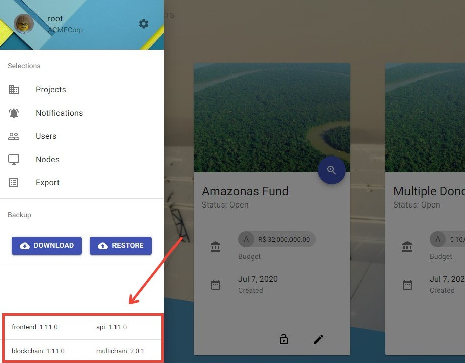

# How to update a TruBudget node

This guide shows three different possibilities how to safely update your Trubudget without any loss of data. Especially the wallet address and the node's private keys need to be remembered, so that the node can be identified within the network and doesn't need to ask for connect permissions again after the update. The wallet address and private keys are stored in the `wallet.dat` file located in the root folder of a multichain node.

## Full state backup

The full state of a node and all its configuration parameters is saved in the node's blockchain directory (e.g. `[PathToMultichainData]/.multichain/TrubudgetChain/`). When backing up the full state of your node, it is required to stop the container first, otherwise the consistency of the backed-up files cannot be ensured.

1. Stop the multichain daemon of the node you want to update
1. Copy the whole chain folder (e.g. `TrubudgetChain`) located in the .multichain folder of the node
1. [Optional] Update Trubudget
1. Put the copied chain folder in the .multichain folder of the new or updated node
1. Start the multichain daemon again so it can connect with its old wallet address/private keys

**Hints**

- Note that a node which is started after an update but before replacing the chain folder, the node will ask for permission to connect to the network since it received a new wallet address.
- If the Trubudget blockchain is running with docker there is currently no way to replace the folder before starting. The network will receive a network access request and currently it cannot be removed from the request stack.
- Make sure the multichain folder especially the wallet.dat file is deleted or securely saved afterwards since it contains the node's private keys and wallet address.

## Full state backup via backup endpoint

TruBudget provides a backup endpoint that allows to perform a backup via the frontend. For a detailed explanation how to create/restore a backup via the frontend check out this guide [Create/Restore a Backup](../../wiki/User-Guide/Backup.md).

1. Log into Trubudget's frontend with the root user
1. Click the backup download button in the side navigation bar
1. Caution: The downloaded backup.gz file can be used to restore the Trubudget node's state again including wallet address and private keys, so be careful.
1. Stop the node
1. Update the node to a newer version
1. Start the node again
1. Log into Trubudget's frontend with the root user
1. Click the backup restore button in the side navigation bar and provide the backup.gz file
1. After a successful restore the root user is logged out automatically

**Hints**

- Only the root user can download/restore a backup via frontend/api.
- Note that a node which is started after an update but before replacing the chain folder, the node will ask for permission to connect to the network since it received a new wallet address.

The side menu shows the current version of your TruBudget.

## Wallet backup

It is possible to perform a backup only of the wallet.dat file. Thus it is not necessary to stop the node and the size of the backed-up data is considerably smaller. The wallet.dat is stored in a node's blockchain directory `[PathToMultichainData]/.multichain/TrubudgetChain/`.

1. Copy the wallet.dat file located in a node's blockchain directory
1. Obtain a another node's address
1. Delete the node's blockchain directory
1. [Optional] Update TruBudget
1. Start to connect to the network using the previously obtained node address
1. Replace the newly created wallet.dat file with the backed-up version of the wallet.dat file
1. Start the multichain daemon again and connect to the network
1. Delete the copy of the wallet.dat file

**Hints**

- MultiChain provides the API command `backupwallet` to directly back up the wallet.dat file but it won't work with the TrubudgetChain, so it is required to copy the file manually.
- Note that after the update a node asks for permission to connect again until the wallet.dat file is replaced since it received a new wallet address.
- Make sure the multichain folder especially the wallet.dat file is deleted or securely saved afterwards since it contains the node's private keys and wallet address.

For further information how to back up and restore a node check out the MultiChain Website: [Backing Up and Restoring Nodes](https://www.multichain.com/developers/backing-up-restoring-nodes/).

### wallet.dat

In the wallet.dat file the wallet address and the private key of a node's wallet is stored. Based on a node's address it will be granted access by the master node. The node is then identified and remembered by its wallet address within the network. Since it's a node's identification it has to be kept confidential and should not be shared with any third party.

### params.dat

In the params.dat file all basic chain parameters are stored. The parameters configure the blockchain and can be modified before the blockchain is initialized. A node's parameters can be retrieved using the `getblockchainparams` API command.

A full list of the blockhain's parameters can be found on the MultiChain Website: [Blockchain Parameters](https://www.multichain.com/developers/blockchain-parameters/).

### multichain.conf

MultiChain creates two multichain.conf files. One is stored in the MultiChain's directory `[PathToMultichainData]/.multichain` and the other one inside of the TrubudgetChain's directory `[PathToMultichainData]/.multichain/TrubudgetChain`. Both contain basic configuration parameters like the RPC Port, the RPC User, the RPC Password and the RPC Allow IP. The first multichain.conf file is created when the blockchain is set up. The second one is created when the node is initialized.

## Hints and Pitfalls

A downloaded backup might sometimes be saved with an invalid hash. When trying to restore the backup using this corrupted .gz file, the error shown below might occur.

If this error occurs and you are certain that the `backup.gz` compressed folder you want to upload is indeed a valid TruBudget backup, you can run a script that will fix the invalid hash, in order to sucessfully restore the backup.

1. Navigate to the `/blockchain` folder and open your favorite shell
1. Type `npm run check_backup` and add the path to the backup.gz file you want to fix (e.g. `npm run check_backup -- "path/to/backup.gz"`)
1. The script will print out the result of the check which tells you if the backup is valid or not.
1. Optionally, type -f/--fix after the path. This option will also fix the hash if it is invalid. A new file `backup updated.gz` will be created in the same location as the one you provided. It is an exact copy of your backup, but with a corrected hash
1. You can now use this file to restore your backup

- Note that if your filename contains a blank space (e.g. `backup (1).gz`), you should use quotation marks when entering the path, so it will be recognized as one argument and not two separate ones.
