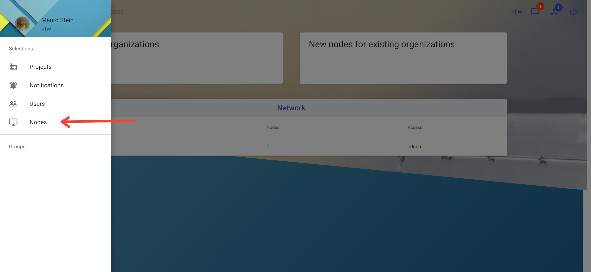

# Nodes

The "Nodes" section is used to approve other organizations and nodes. An organization can have many nodes. If a new organization wants to join the network all organizations in the network may vote for this organization. After 50% voted for the organization to join the network an organization can approve it.

## View Nodes

**Description:**

View all organizations and nodes of the current network. Each organization has one entry in the network list on the nodes site. The list also shows the number of nodes the organization have and which access the nodes have. In the top cards "New Organizations" and "New nodes for existing organizations" organizations or nodes waiting for approval are shown. 

**Notes:**

- The number of nodes of an organization in the network list shows how many nodes have been connected not the currently connected ones.

**Instructions:**

1. Click the button in the upper left corner to open the side-navigation-bar
2. Click the "Nodes" menu point

