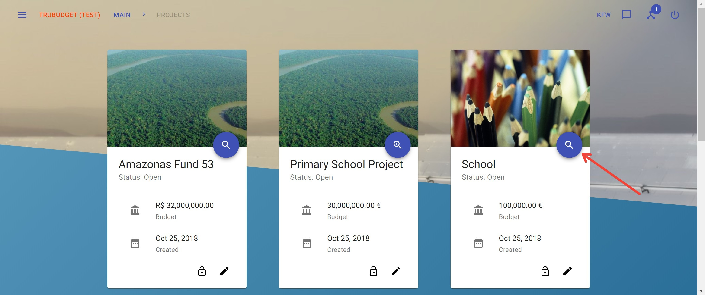
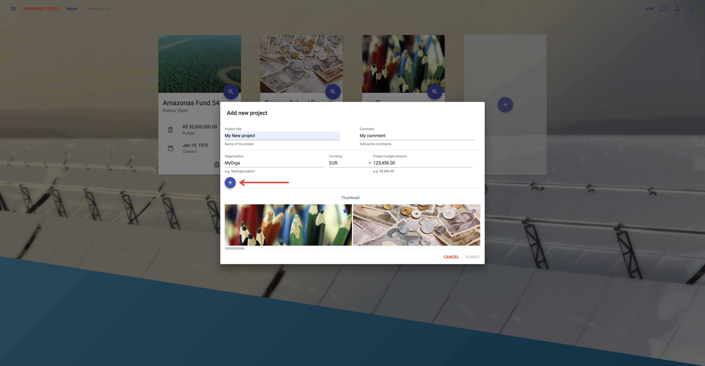
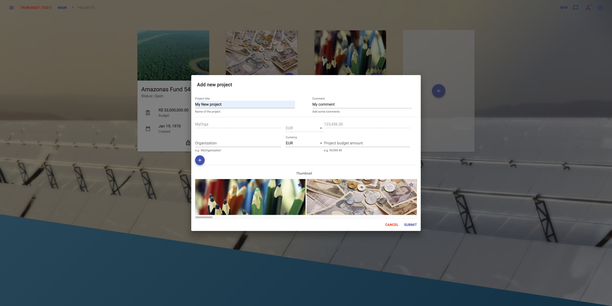
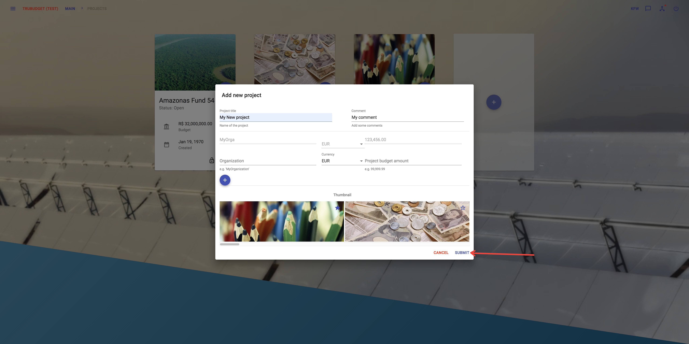
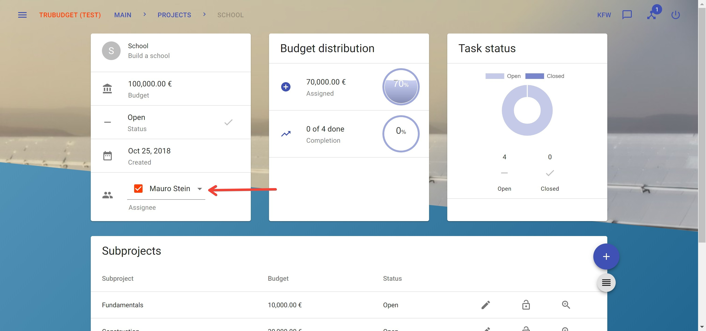

# Project

- [Project](#project)
  - [View projects](#view-projects)
  - [View project details](#view-project-details)
  - [Create a project](#create-a-project)
  - [Update a project](#update-a-project)
  - [Assign an User/Group to a project](#assign-an-usergroup-to-a-project)
  - [Close project](#close-project)
  - [View the history of a project](#view-the-history-of-a-project)
  - [Permissions on project](#permissions-on-project)
  - [Create a subproject](#create-a-subproject)

Projects are currently the highest layer of abstraction in TruBudget. They represent the overall intention of what you trying to achieve, like building a school in Malawi.

There are some different permissions which affect projects.

- project.viewSummary
- project.viewDetails
- project.assign
- project.update
- project.intent.listPermissions
- project.intent.grantPermission
- project.intent.revokePermission
- project.createSubproject
- project.viewHistory
- project.close

More details about the permission model can be found in the [Permissions section](../Permissions.md).

## View projects

**Description:**

View all projects where the current user has view-permissions on.

**Notes:**

- An alternative way to view the projects site is to click on the Main Button in the upper left corner.
- To view the project's details take a look at the [View project details section](#view-project-details) below.

**Instructions:**

1. Click the button in the upper left corner to open the side-navigation-bar
2. Click the "Projects" menu point

## View project details

**Description:**

View details like budget distribution or task status of a project.

**Notes:**

- The project.viewDetails permission does not permit to view any subproject.

**Instructions:**

1. Click the button in the upper left corner to open the side-navigation-bar
2. Click the "Projects" menu point
3. Click the blue magnifier icon in the bottom right corner of a project

## Create a project

**Description:**

Create a new project defining title, comment and budgets.

**Notes:**

- Do not forget to permit other users to view/edit the newly created project.
- You have to add at least one budget before you can submit the project.
- To add a budget, the "+" button needs to be pressed. Only budgets that appear above the text field are saved to the blockchain.

**Instructions:**

1. Click the button in the upper left corner to open the side-navigation-bar
2. Click the "Projects" menu point
3. Click the '+' icon in the middle of the grey card next to the other projects if there are any

4. Fill in the required fields:

   - "Project Title": Title of the project
   - "Comment": A little description or comment refering to the project
   - "Organization": Organization that the budget belongs to
   - "Currency": The currency of the organization's budget
   - "Amount": The amount of the organization's budget

5. Add the budget of the organization by clicking the "+" symbol
   
   After this, the entered budget will appear on the screen
   

6. Change the thumbnail to a picture that fits best for your project

7. Click the "Submit"-button to create a new project.
   

## Update a project

**Description:**

Update details like title, currency, comment or budget amount of a project.

**Notes:**

- The pen icon can only be viewed if the current user has update permissions.
- The pen icon disappear if the project is closed

**Instructions:**

1. Click the button in the upper left corner to open the side-navigation-bar
2. Click the "Projects" menu point
3. Click the pen icon in the bottom right corner of a project

4. Fill in the fields that shall be updated:

   - "Project Title": Title of the project
   - "Comment": A little description or comment refering to the project
   - "Currency": Currency of the project
   - "Project budget amount": Assigned budget to the project

5. Change the thumbnail to a picture that fits best for your project

6. Click the "Submit"-button to update the project.

## Assign an User/Group to a project

**Description:**

Assign a User or Group to a project to show which User or Group is responsible for it.

**Notes:**

- Only assigning a user to a project doesn't permit this user to view the project. These permissions have to be set separately.

**Instructions:**

1. Click the button in the upper left corner to open the side-navigation-bar
2. Click the "Projects" menu point
3. Click the blue magnifier icon in the bottom right corner of a project
4. Click the assignee dropdown field to open a selection where the right user or group can be selected and assigned to the current project

## Close project

**Description:**

Close a project when all subprojects are closed.

**Notes:**

- A project can only be closed if all subprojects are closed and the user has the project.close permission.

**Instructions:**

1. Click the button in the upper left corner to open the side-navigation-bar
2. Click the "Projects" menu point
3. Click the blue magnifier icon in the bottom right corner of a project
4. Click the done-button next to the status section to close the current project

## View the history of a project

**Description:**

The history contains all activities done directly refer to the current project.

**Notes:**

- The history of actions refer to workflowitems can only be viewed by the [history](../Projects/Subproject.md) of a certain subproject

**Instructions:**

1. Click the button in the upper left corner to open the side-navigation-bar
2. Click the "Projects" menu point
3. Click the blue magnifier icon in the bottom right corner of a project
4. Click the grey button below the '+' button on the right to open the right sidebar viewing the history of the current project.

## [Permissions on project](../Permissions.md)

## [Create a subproject](./Subproject.md)
