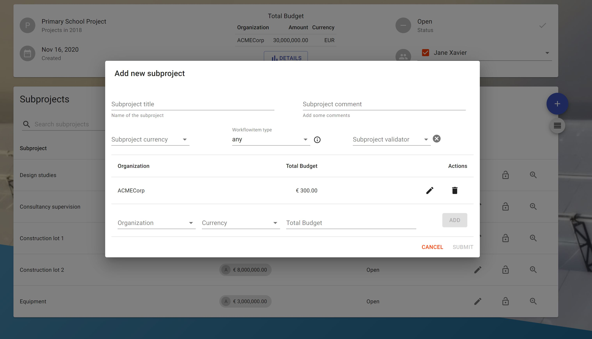

# Subproject

- [Subproject](#subproject)
  - [View subprojects](#view-subprojects)
  - [Filter subprojects](#filter-subprojects)
  - [View subproject details](#view-subproject-details)
  - [Create a subproject](#create-a-subproject)
  - [Update a subproject](#update-a-subproject)
  - [Assign an User/Group to a subproject](#assign-an-usergroup-to-a-subproject)
  - [Close subproject](#close-subproject)
  - [View the history of a subproject](#view-the-history-of-a-subproject)
  - [Filter the history of a subproject](#filter-the-history-of-a-subproject)
  - [View the additional data of a subproject](#view-the-additional-data-of-a-subproject)
  - [Permissions on subproject](#permissions-on-subproject)
  - [Create a workflowitem](#create-a-workflowitem)

A project is normally split into a fraction of sub-task and Trubudget calls them **Subprojects**.
In case of the school example the overall project would be the "School" having multiple subprojects like Design studies, Construction lot, Equipment...

There are some different permissions which affect subprojects.

- subproject.intent.listPermissions
- subproject.intent.grantPermission
- subproject.intent.revokePermission
- subproject.viewSummary
- subproject.viewDetails
- subproject.assign
- subproject.update
- subproject.close
- subproject.archive
- subproject.createWorkflowitem
- subproject.reorderWorkflowitems
- subproject.viewHistory

More details about the permission model can be found in the [Permissions section](../Permissions.md).

## View subprojects

**Description:**

View all subprojects where the current user has view-permissions on.

**Notes:**

- To view the subproject's details take a look at the [View subproject details section](#view-subproject-details) below.

**Instructions:**

1. Click the button in the upper left corner to open the side-navigation-bar
2. Click the "Projects" menu point
3. Click the blue magnifier icon in the bottom right corner of a project

4. At the bottom half of the site all subprojects of the current project are viewed

## Filter subprojects

**Description:**

There are 2 ways how subprojects can be filtered:

1. Searchbar
2. URL

The Searchbar can be used to search all projects for a term included in name, tag or status. These can also be used as prefixes to specify the search context (e.g. tag:mycustomtag). If no prefix is used display name, tag and status are searched for a match. After typing the project list and the URL are updated instantly. The URL can then be shared to other users including the filter.
The URL supports query parameters which are updated instantly when typing search terms into the searchbar.

**Notes:**

- Use prefixes to search specific attributes. Available Prefixes: tag, name, status
- The filter options can be easily shared by copying the link after typing in the search terms into the searchbar.

**Instructions:**

1. Navigate to a project
2. On the left side you can see the searchbar
3. Type in the term by which you want to filter the projects
4. The subprojects are now filtered by your search term

## View subproject details

**Description:**

View details like budget distribution or task status of a subproject.

**Notes:**

- The subproject.viewDetails permission does not permit to view any workflowitem.

**Instructions:**

1. Click the button in the upper left corner to open the side-navigation-bar
2. Click the "Projects" menu point
3. Click the blue magnifier icon in the bottom right corner of a project
4. Click the grey magnifier icon on the most right of the subproject you want to view

## Create a subproject

**Description:**

Create a new subproject defining title, comment, currency, budget, validator and workflowitem type.

**Notes:**

- The root user may not create subprojects.
- Do not forget to permit other users to view/edit the newly created subproject.
- You have to add at least one budget before you can submit the project.
- To add a budget, the "+" button needs to be pressed. Only budgets that appear above the text field are saved to the blockchain.
- The validator is an optional field
- The workflowitem type is an optional field

**Instructions:**

1. Click the button in the upper left corner to open the side-navigation-bar
2. Click the "Projects" menu point
3. Click the blue magnifier icon in the bottom right corner of a project
4. Click the '+' button on the right to open the creation dialog

5. Fill in the required fields:

   - "Subproject Title": Title of the subproject
   - "Comment": A little description or comment refering to the subproject
   - "Organization": Organization that the budget belongs to
   - "Currency": The currency of the organization's budget
   - [Optional]"Validator": Select a user identity
     1. Defines the default assignee of each workflowitem created in this subproject
     1. Defines the only user who is allowed to close workflowitems in this subproject
   - [Optional]"Workflowitem type": Select a type which should be applied to all workflowitems in thios subproject. Workflowitems behave differently according to their type.
     - general: A workflowitem of type general will be created
     - restricted: When assigning a restricted workflowitem permissions are automatically granted and revoked. The assigner will only keep the view permissions.

6. Add the projected budget of the organization by clicking the "+" symbol
   After this, the entered budget will appear on the screen
   
7. Click the "Submit"-button to create a new subproject.

## Update a subproject

**Description:**

Update details like budget amount or title of a subproject.

**Notes:**

- The pen icon can only be viewed if the current user has update permissions.
- The pen icon disappear if the subproject is closed
- Updating the workflowitem type is not possible
- Updating the validator is not possible

**Instructions:**

1. Click the button in the upper left corner to open the side-navigation-bar
2. Click the "Projects" menu point
3. Click the blue magnifier icon in the bottom right corner of a project
4. Click the pen icon next to the status of the subproject which shall be updated
5. Fill in the fields that shall be updated:

   - "Subproject Title": Title of the subproject
   - "Comment": A little description or comment refering to the subproject
   - "Currency": Currency of the subproject

6. Click the "Submit"-button to update the subproject.

## Assign an User/Group to a subproject

**Description:**

Assign a User or Group to a subproject to show which User or Group is responsible for it.

**Notes:**

- Assigning a user/group needs project and subproject view permissions.
- If the assignee has not all necessary view permissions yet a dialog opens which shows all required permissions.
  On confirm they can be granted if the assigner has grant permissions. (see [confirmation](../Confirmation) for more Details)

**Instructions:**

1. Click the button in the upper left corner to open the side-navigation-bar
2. Click the "Projects" menu point
3. Click the blue magnifier icon in the bottom right corner of a project
4. Click the grey magnifier icon on the most right of the subproject you want to view
5. Click the assignee dropdown field to open a selection
6. Select and click on an user or group to open a [confirmation dialog](../Confirmation)
7. In case the assigner has no project view permissions the user or group cannot be assigned
8. Confirming the dialog first executes all additional actions listed if there are any, then assigns the user
9. If no addtional permissions have to be granted the user or group is assigned

## Close subproject

**Description:**

Close a subproject when all workflowitems are closed.

**Notes:**

- A subproject can only be closed if all workflowitems are closed and the user has the subprojectproject.close permission.

**Instructions:**

1. Click the button in the upper left corner to open the side-navigation-bar
2. Click the "Projects" menu point
3. Click the blue magnifier icon in the bottom right corner of a project
4. Click the grey magnifier icon on the most right of the subproject you want to view
5. Click the done-button next to the status section to close the current subproject

## View the history of a subproject

**Description:**

The history contains all activities done and directly refer to the current subproject.

**Notes:**

- The history of actions refer to workflowitems are also viewed.

**Instructions:**

1. Click the button in the upper left corner to open the side-navigation-bar
2. Click the "Projects" menu point
3. Click the blue magnifier icon in the bottom right corner of a project
4. Click the grey magnifier icon on the most right of the subproject you want to view
5. Click the grey button below the '+' button on te right to open the right sidebar viewing the history of the current subproject.

## Filter the history of a subproject

**Description:**

The entries in the history can be filtered by 4 different values: publisher, type of event, a start date and a end date, where a timeframe can be determined. By clicking the search button, all values that are specified are used in the filter request.

**Instructions:**

1. Click the button in the upper left corner to open the side-navigation-bar
2. Click the "Projects" menu point
3. Click the blue magnifier icon in the bottom right corner of a project
4. Click the grey magnifier icon on the most right of the subproject you want to view
5. Click the grey button below the '+' button on te right to open the right sidebar viewing the history of the current subproject
6. Click on the top of the sidebar to open the expandable filter area

## View the additional data of a subproject

**Description:**

The additional data is a free field that can be used to extend the subproject data beyond the visible information like display name and budget. To view this data, an additional button was added that opens a window containing the data of this field.

**Notes:**

- There is no logic to format the data.

**Instructions:**

1. Click the "..." button on the right side of the subproject
2. A window appears containing the additional information on the subproject
3. Close the window by clicking "close"

## [Permissions on subproject](../Permissions.md)

## [Create a workflowitem](./Workflowitem.md)
