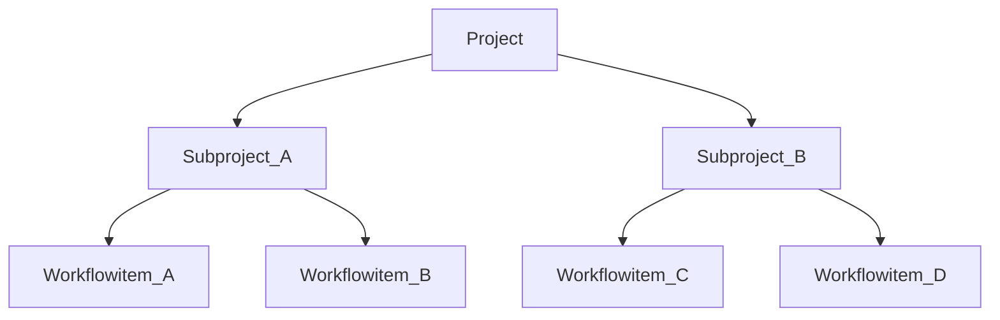

# Data model for projects

Date: 17/04/2018

## Status

Accepted

## Context

We need to define how to save and query project, subproject and workflow data efficiently.

### Definition of terms

- Project: Is the root element of the hierarchy. It contains metadata and Subprojects
- Subproject: Are a subset of Projects and collect a number of Workflowitems
- Workflowitems: Are a number of steps which need to be executed in a certain order
- Resources: Projects, Subprojects, Workflowitems are resources. This means they contain permissions, a log and metadata.

### Relations

### Options

1. Each resource has its own stream. Each resource has an array which links to the underlying resources (e.g. A Projects has an array of the ids of its Subrojects). That means if we want to query Subprojects of a specific Project, we need to lookup the Subproject ID's inside the projects to afterwards fetch all the underlying Subproject streams. **Pro:** We are only fetching the data which is necessary, changes inside the resources are storage efficient. **Con:** Resources with a high number of relations result in multiple (maybe hundreds) of queries.
2. Each Project has its own stream. All relational resources of the projects are stored inside a JSON and resolved on the API Layer. **Pro:** Only one query necessary to resolve the whole resource tree for one project. **Con:** Large amount of storage needed, since every change inside a single resource would trigger a whole copy of the project tree. Large data structures have to be kept in memory
3. Each project has its own stream. All relational resources are organized with multiple key-items inside the project stream. This allows to specifically query resources with a single query. Updates to resources will only result in the copy of the affected resource. **Pro:** Easy to query, low storage / memory footprint **Con:** None

## Decision

Since we need to be able to scale out to larger projects, it is important to be able to execute fast queries and having a low storage / memory footprint. The goal is to exploit the Multichain API as much as possible, since we can expect it to be more performant than our API. Option 3 is the option, which covers the required capabilities in the best way.

## Implementation

Each project will have its own stream. It contains its own resources specific metadata inside specific keys (e.g. \_logs, \_permissions, \_metadata). All underlying resources will be stored with specific key arrays.

| Keys                                                     | Resource                   |
| -------------------------------------------------------- | -------------------------- |
| "\_log"                                                  | Changelog of the project   |
| "\_permissions"                                          | Permissions of the project |
| "\_metadata"                                             | Details of the project     |
| ["subprojects", "\<id of subproject\>"]                  | Subproject                 |
| ["\<id of subproject\>_workflows", "\<id of workflow\>"] | Workflow                   |

To efficiently query the resources we can execute the following commands:

| Action                          | Command                                           |
| ------------------------------- | ------------------------------------------------- |
| Get project details             |                                                   |
| List all subprojects            | `liststreamkeyitems projectx subprojects`         |
| Get specific subproject details | `liststreamkeyitems projectx tenderxyz`           |
| List workflows                  | `liststreamkeyitems projectx tenderxyz_workflows` |
| Get specific workflow details   | `liststreamkeyitems projectx workflowxyz`         |

## Consequences

With this solution we have a minimal amount a calls and fast retrieval of resource data. Performance tests need to be executed but we expect this method to scale well when the amount of resources grows
