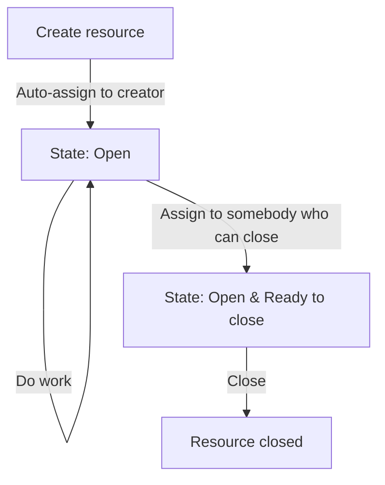
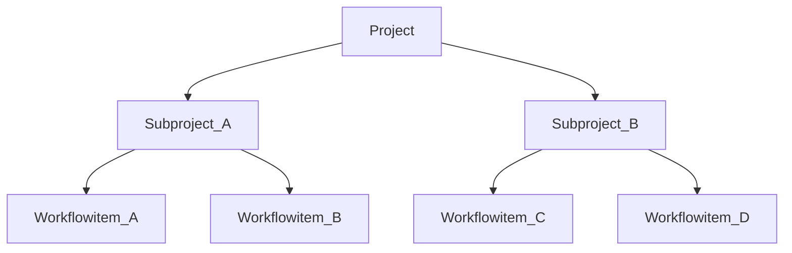

# Resource-level lifetime

Date: 23/04/2018

## Status

Draft

## Context

Resources have semantically a certain lifetime. That means, after a resources is created it will experience state-transition until it reaches the end of its lifetime (e.g. archival). The lifetimes and state-transitions need to be defined in an abstract way, in order to allow the platform to excel for different use-cases.

## Decision

### Lifetime of a single resource

Re-Opening is not supported; it could be discussed as long as the parent is still open (hierarchy must hold). Different usage-scenarios are accommodated via _manual_ steps.

#### Example: 4-Eyes Principle

Scenario: A subproject must only be closed when 2 people A & B (e.g. different departments) checked it.

Prereqs: Closing right is given to an administrative person and not to the people signing off

Approach:

1. Subproject is executed as usual, then for sign-off is assigned to Person A
2. Sign-Off Person A enters a Workflow-Item validating the state and assigns Person B
3. Sign-Off Person B enters a Workflow-Item validating the state and assigns to administrative personell that has the close-rights
4. Administrative person checks whether all required sign-offs are there and then finally closes; otherwise assigns back

### Impact to child resources

A resource hierarchically describes a node in a tree-like structure. Therefore we need to look at impact of a closed resource to other nodes in the tree.

If a resource has no children, there is no impact on other resources.

If a resource has children (e.g. subprojects / workflowitems), **the resource cannot be closed**. All children need to be in state closed before a parent can be closed.

## Implementation

This ADR is designed to enable a MVP implementation. Implementation consists of a check before closing a project whether all subprojects have already been closed.

## Consequences

- Re-opening is not supported
- No automatic closing in hierarchy for now
- System blocks closing if there are open children
- No system-support for specific usage patterns

This approach is on-purpose very lightweight and agnostic to usage pattern. Once needs are understood better system support for scenarios like 4-eyes-principle can be established through a new / updated ADR and formally manifested in the ledger in machine-readable format.
