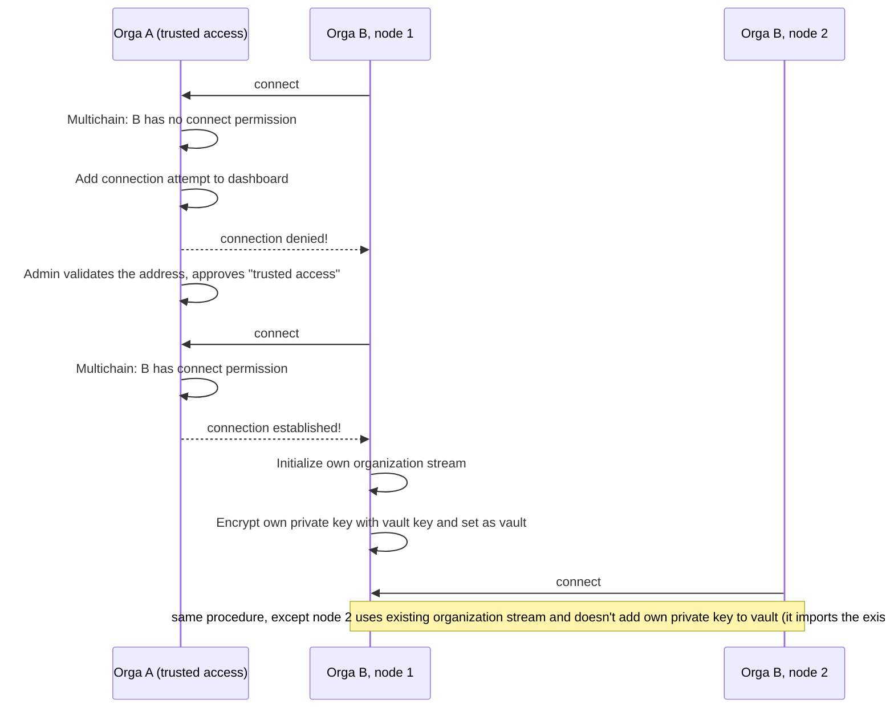

# Multi-node setup

Date: 05/07/2018

## Status

Superceded by [multi node setup](./0010-multi-node-setup-and-user-management.md)

## Context

Even though Multichain (like Bitcoin) has to be bootstrapped from a single node, we're aiming at a system design that doesn't rely on a single party being involved in most administrative tasks, such as adding additional nodes to an existing deployment.

This ADR discusses terminology and setup of the TruBudget network.

## Decision

### Terminology

Each _node_ is associated to a single _organization_ (e.g. ACMECorp, UmbrellaCorp), including the special _origin node_, which mines the first block in the network. Nodes that belong to the same organization are called _internal peers_; nodes that belong to other organizations are called _external peers_.

### Blockchain Addresses

User authenticate themselves using username and password, but internally every user is assigned a blockchain address, along with a public and a secret key. On the chain, each action is then associated with the user's key and the associated permissions, which makes operations secure and auditing reliable.

With Multichain, each node owns a unique address, generated when started the first time (its wallet address). In day-to-day operations, those addresses are not used and only the address of the first node of an organization is put on the chain (and thus propagated among nodes).

By mining the genesis block (that is, the first block in the network), the origin node gets _full_ permissions on _everything_, which includes exclusive access to the `root` stream. The permissions are bound to the origin-node's address; we call the associated key _origin root key_ (ORK). The ORK is not put on the chain and should be backed up by the administrator; it is also not used in day-to-day operations. Instead, the ORK is used to create another node address that holds necessary permissions; that key is called _organization key_.

### Distributing secret keys

The organization key is put on the chain, into a stream-item on the organization's stream, called the _vault_. The vault holds the private keys of all (technical and non-technical) users of the organization. In order to prevent other organizations from using them, the vault needs to be encrypted. The encryption key is a shared secret known to all internal peers, called the _organization vault secret_ (OVS). Whenever ~~the vault is updated, all internal peers import new keys into their wallet (using a walletnotify script)~~ a user logs in, the user's private key is read from the vault and imported into the node's wallet, which allows users to move freely between their organization's nodes.

### Joining the network

There are two ways an organization can join the network:

1. The organization maintains the origin node, in which case the ORK is used to create the organization key (see above).
1. For all other organizations, the first node needs to connect to any node of an organization that has _trusted access_ (see below).

#### Trusted vs. managed access

In the TruBudget network, there are two types of organizational access to the network: _admin_ and _basic_. The main difference is that with admin the node can also _mine_ and write to so-called "admin" streams. In TruBudget, each organization should have exactly one address (the _organization address_) with admin permissions; all other node addresses should have basic access only. This ensures that a single organization cannot manipulate the network without other organizations noticing.

In other words, connecting as a new organization **B** to an existing TruBudget network of organization **A** works as follows:

1. **A** gives **B** the API URL of any one of their nodes.
1. **B** runs TruBudget for the first time, pointing it to the given URL. Since the instance address is unknown to **A**'s node, the connection fails; instead, the administrator of **A** will see the connection request in TruBudget's connection dashboard. Meanwhile, the node of **B** continues its connection attempts.
1. The administrator of **A** verifies the address by calling **B**, asking them for confirmation. The administrator then chooses "trusted access" for the connection request. The address of the node of **B** is now **B**'s organization key.
1. Now that the `connect` permission has been granted, **B**'s node is finally able to establish a connection, joining the network and fetching all existing data in the process. Since the organization stream for **B** is not yet present, the node infers it's **B**'s first node; consequently, the node creates the organization stream and initializes the "vault" stream-item with its encrypted private key (= organization key).

With managed access, the connecting organization cannot execute the last step itself.

### User Management

`N Users <-> 1 Organization`

As mentioned above, each organization's users have their addresses and private keys stored in the organization's vault, which is encrypted using the organization vault secret (OVS). The OVS is initialized using the `VAULT_SECRET` environment variable.

Consequently, all client-related operations are only possible on nodes that have the right OVS set in their environment (typically equal to the nodes that belong to the same organization as the requesting user):

- user creation, as it directly modifies the vault
- authentication, since it causes the user's private key to be imported in the node's wallet, which in turn requires read access to the vault
- all other API calls, as the token is always augmented with the user's private key, which requires read access to the vault

To ease testing (and because it doesn't affect production), a node always tries to decrypt the vault that belongs to the user's organization, without checking first whether it belongs to that organization itself. A node always belongs to a single organization, but using the same OVSs for all organizations enables a node to cater all API requests (not to be done in production, because then all nodes have all keys of all users of all organizations in their wallet, basically circumventing all other security mechanisms).

## Consequences

This ADR describes the general idea behind the setup.
