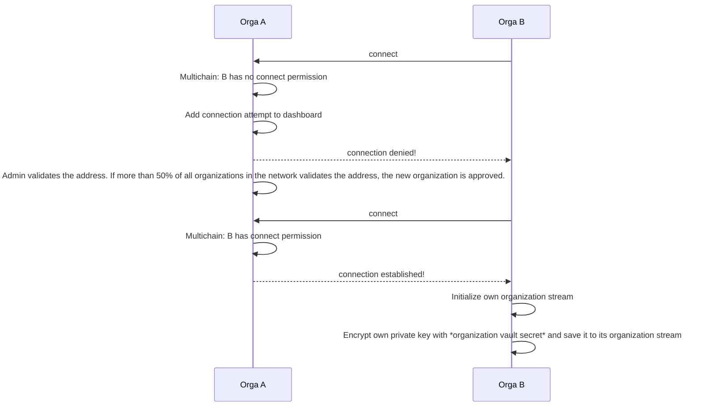
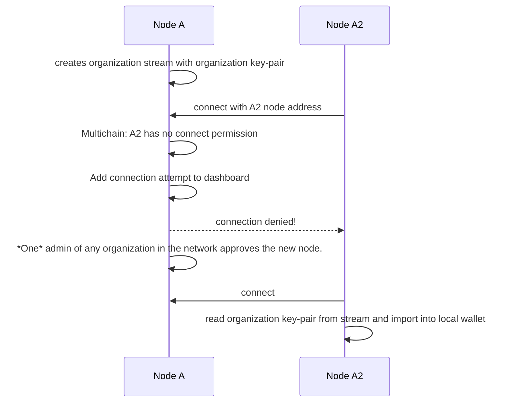

# Multi node setup and user management

Date: 2018-12-12

## Status

Draft

## Context

Even though Multichain (like Bitcoin) has to be bootstrapped from a single node, we're aiming at a system design that doesn't rely on a single node being involved in most administrative tasks, such as adding additional nodes to an existing deployment.

This ADR discusses terminology and setup of the TruBudget network.

## Decision

### Terminology

Each **node** is associated to a single _organization_ (e.g. ACMECorp, UmbrellaCorp).
The **origin node** refers to the one node, which mines the first block in the whole network. Nodes that belong to the same organization are called _internal peers_, nodes that belong to other organizations are called _external peers_.
The **organization's address** is used to identify the organization in the network.
The **private key** is used to authenticate members of the organization, it is encrypted using the ORGANIZATION*VAULT_SECRET.
The **ORGANIZATION_VAULT_SECRET** is a shared key between internal peers used to en-/decrypt the private key. It is saved in an environment variable on the API host of a node.
A **user** is a member of an organization. To access the Trubudget API, the user is given a username and password. When performing actions (which are described by their \_intent*, e.g. "project.create" or "global.addUser") the API writes this action in form of an _event_ to the blockchain.
An **event** describes a performed action like creating a project or adding users and holds meta data like timestamp or creator.
Example for creating a group "MyGroup" with users "user1" and "user2":

```json
{
  "key": "123",
  "intent": "global.createGroup",
  "createdBy": "root",
  "createdAt": "2018-12-17T14:52:11.511Z",
  "dataVersion": 1,
  "data": {
    "group": {
      "groupId": "123",
      "displayName": "MyGroup",
      "users": ["user1", "user2"]
    }
  }
}
```

The first data added to the blockchain is the organization's address and (encrypted) private key:

```json
{
  "publishers": ["1bNueyVy4j7V6yRSa6SDyHhkfVBHyFJ4QoAiD4"],
  "keys": ["address"],
  "offchain": false,
  "available": true,
  "data": {
    "json": {
      "address": "1bNueyVy4j7V6yRSa6SDyHhkfVBHyFJ4QoAiD4",
      "privkey": "151fca5bbb689321a410c5646cc81a582c7bdade7365a806c994b530b9f28689e67b29af306996f0e95ea47a0ec66fc0bca9c78b7ce7510f71e95111a476d0cb6799b431b249d5a632ddc45aa1984f8fe8c2bcbd903bc6d9c6b8ba8458efb5b5"
    }
  },
  "confirmations": 8,
  "blocktime": 1545054793,
  "txid": "c3ce3a37669d7ce005c7813a1e9a97152fac873cc9149ad81eadea5f78c6718e"
}
```

### Distributing secret keys

In order to prevent other organizations from using the private key, it is encrypted.
The encryption key is a shared secret known to all internal peers, called the **organization vault secret** (OVS).
Each internal peer uses the address and private key of the first node of its organization after [joining the network](#joining-as-new-node-of-an-existing-organization).
Each action of any user is published to the multichain using the corresponding organization's private key ,no matter through which internal peer he/she is connected.

Sidenote:
Each user has their own pair of address and private key which is held by a streamitem on the _users_ stream, which currently is not in use.
(_In the future_ whenever a user logs in, the user's address should be read from the _users_ stream. Then this keypair is used to publish any data using command _publishfrom_)

### Creating a network

To create a new network the origin node creates the genesis block (i.e. the first block of a blockchain) and the multichain creates the organization's address and private key. The new organization creates its own stream (e.g. org:ACMECorp) and writes its address and encrypted private key to the first streamitem ([see above](# Terminology)).

### Joining the network

#### Joining as new organization

In this case, a new organization wants to join an already existing network. Example: ACMECorp already has one note in the network and UmbrellaCorp wants to join.

A = Orga A (e.g. ACMECorp)
B = Orga B (new organization, e.g. UmbrellaCorp)



#### Joining as new node of an existing organization

In this case a new node from an organization that already has a node in the network wants to join. Example: ACMECorp has one node in the network and a new ACMECorp node wants to join the network.
The main difference here is, that you only need the approval of one admin user from another node in the network.

Important: Even though the new node of the organization has its own address, only the address and private key of the already existing node is used for future transactions. It is therefore absolutely necessary that both nodes have the same ORGANIZATION_VAULT_SECRET.

Node A = first node of Orga A (e.g. ACMECorp)
Node A2 = second node of Orga A



## Consequences

- for each type of streamitem (e.g. project, users) a specific data-version can be set.
