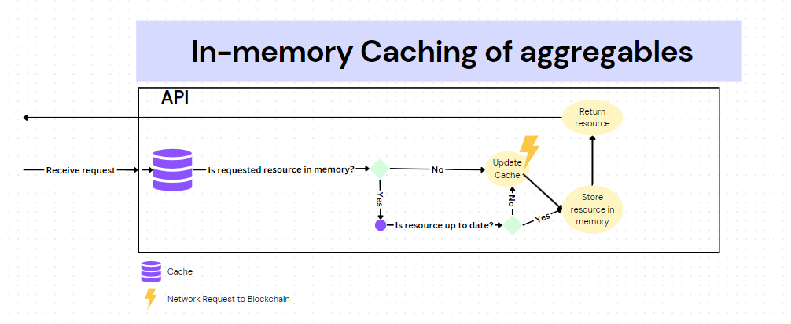
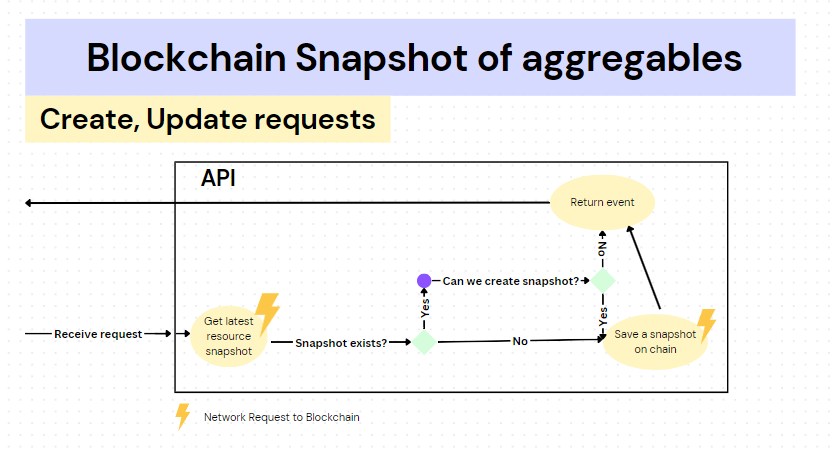
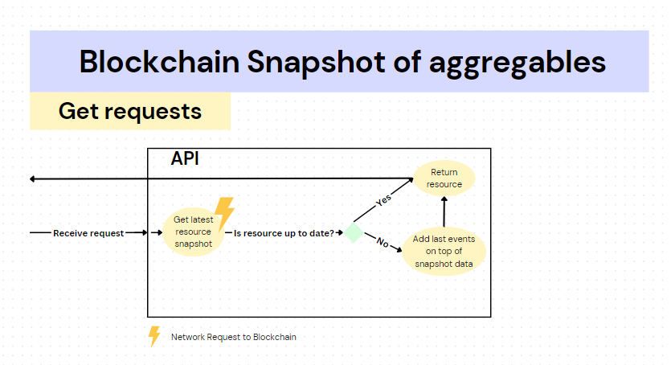

# Snapshots of aggregable items in Blockchain

Date: 06/11/2023

## Status

Accepted

## Terminology
| Term | Description |
--- | --- |
Aggregables/Aggregable item | This term refers to projects, subprojects or/and workflowitems |
| Snapshot | Snapshot is a data model containing the latest state of an aggregable item |

## Context

Currently when aggregable items such as projects, subprojects and workflow items are fetched via Api, they are stored in a cache, which is basically an in-memory storage of the Node.js application. Since there is no cache invalidation, the impact on the memory becomes a concern when the number of aggregable items increase over time. We want to be able to still use some form of caching to reduce the memory impact and the data sent over the network by blockchain, but also for the sake of minimalist design, we want to avoid introducing more middleware applications that perform caching operations.

### Current implementation with in-memory caching

The diagram above explains how the in-memory caching works in TruBudget. Aside from working similar to a simple cache, the step "Update Cache" has the most impact on the performance of the application. When any aggregable item is requested from the blockchain, the cache fetches all of the available aggregable items and updates the whole cache storage. For example, if requested project is not found in cache storage, the whole cache will be updated including projects, subprojects and workflow items. This results in unnecessary amounts of data processing and data transfer size over the network.

## Decision

In order to reduce application memory load, in-memory cache will be removed with an alternative solution without the help of a middleware application. For this we are utilizing the blockchain on-chain storage. A new type of event for each aggregable item will be created with a `_snapshot_published` suffix. The data stored in this event is called a snapshot.

### Event Data Model
#### Common event data
Each snapshot event consists of the following common fields:
| Fields |
--- |
| type |
| source |
| time |
| publisher |

#### Item specific event data
In addition to the common fields, following fields for given events are present:

`project_snapshot_published`
| Fields |
--- |
| project* | 

`subproject_snapshot_published`
| Fields |
--- |
| projectId |
| subproject* |

`workflowitem_snapshot_published`
| Fields |
--- |
| projectId |
| subprojectId |
| workflowitem* |

With * marked fields are aggregable objects that contain the latest event and item data relevant to the item type. Below you can find more info about how these objects are created and the workflow.

### Planned implementation with Snapshot logic

#### Create and Update requests

When Api receives a request which modifies or creates an aggregable item, it checks if a snapshot for the aggregable item exists. If there is no snapshot available (creation scenario), we create a snapshot with the most up-to-date aggregable data. (e.g if we are creating a project, snapshot would contain the created project data.) If there is a snapshot, the api checks for the following condition:

* Did at least 3 events happened after the last snapshot event? (Roughly translates to "Did the item state change at least 3 times since last snapshot?")

If yes, we make a new snapshot event by applying all event data that happened since last snapshot event on top of the last snapshot including the current event.

If no, we apply the event/requested change normally and no snapshots are made.

> The event number (by default 3) in the above condition is an environment variable which can be changed per deployment.

#### Get Requests

Workflow for Get requests are a bit different. Api checks as usual if a snapshot for the aggregable item exists. It then checks if the received snapshot is actually the latest event that was applied to the aggregable item. If it is, this means the snapshot contains the latest up-to-date state of the aggregable. If the latest event is not a snapshot event for the aggregable, then all the events after the latest snapshot event are applied in order to the latest snapshot data and served back from the Api as the up-to-date aggregable data.

## Performance metrics on loading times
Below are metrics for average request durations over the network on each aggregable items.

#### Test with 40~50 projects, 800~1000 subprojects and 16000~20000 workflowitems 

| | In-memory Caching | Blockchain Snapshot
--- | --- | ---
| Projects | 607.89ms | 633.11ms |
| Subprojects | 541.56ms | 95.55ms |
| Workflow items | 496.76ms | 492.41ms |

#### Test with 70~80 projects, 1400~1600 subprojects and 28000~32000 workflowitems 

| | In-memory Caching | Blockchain Snapshot
--- | --- | ---
| Projects | 848.24ms | 1.19s |
| Subprojects | 967.36ms | 98.98ms |
| Workflow items | 1.09s | 228.92ms |

## Consequences

Despite significantly reduced load on the application memory and reduced loading times, we now have an increased amount of network requests due to fetching of snapshots, which means slightly higher chances of network-caused errors occurring when displaying projects, subprojects and workflowitems.
