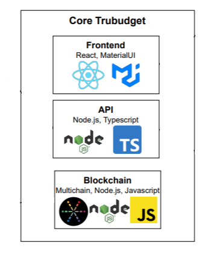
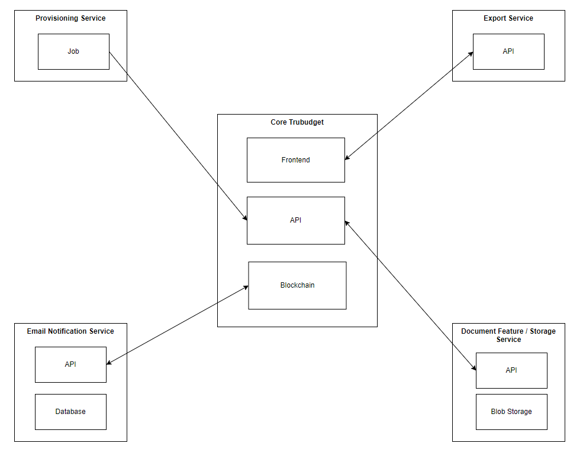
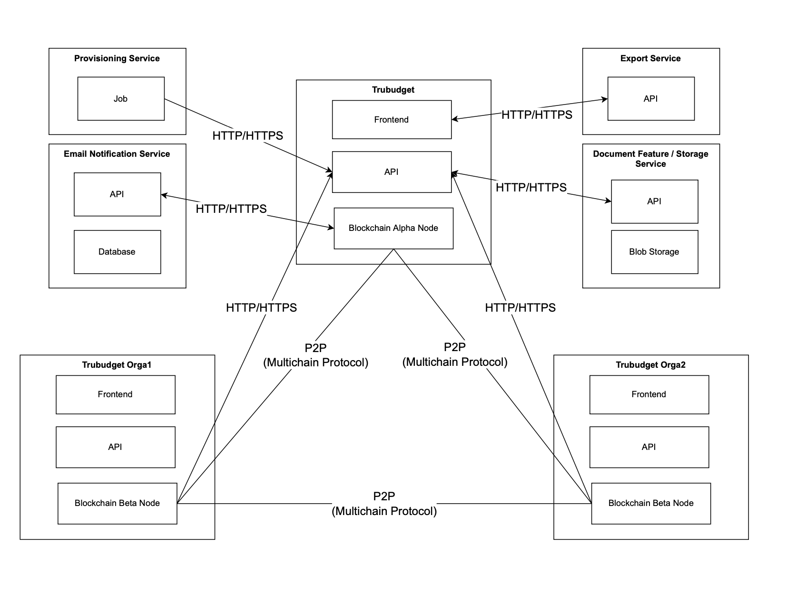
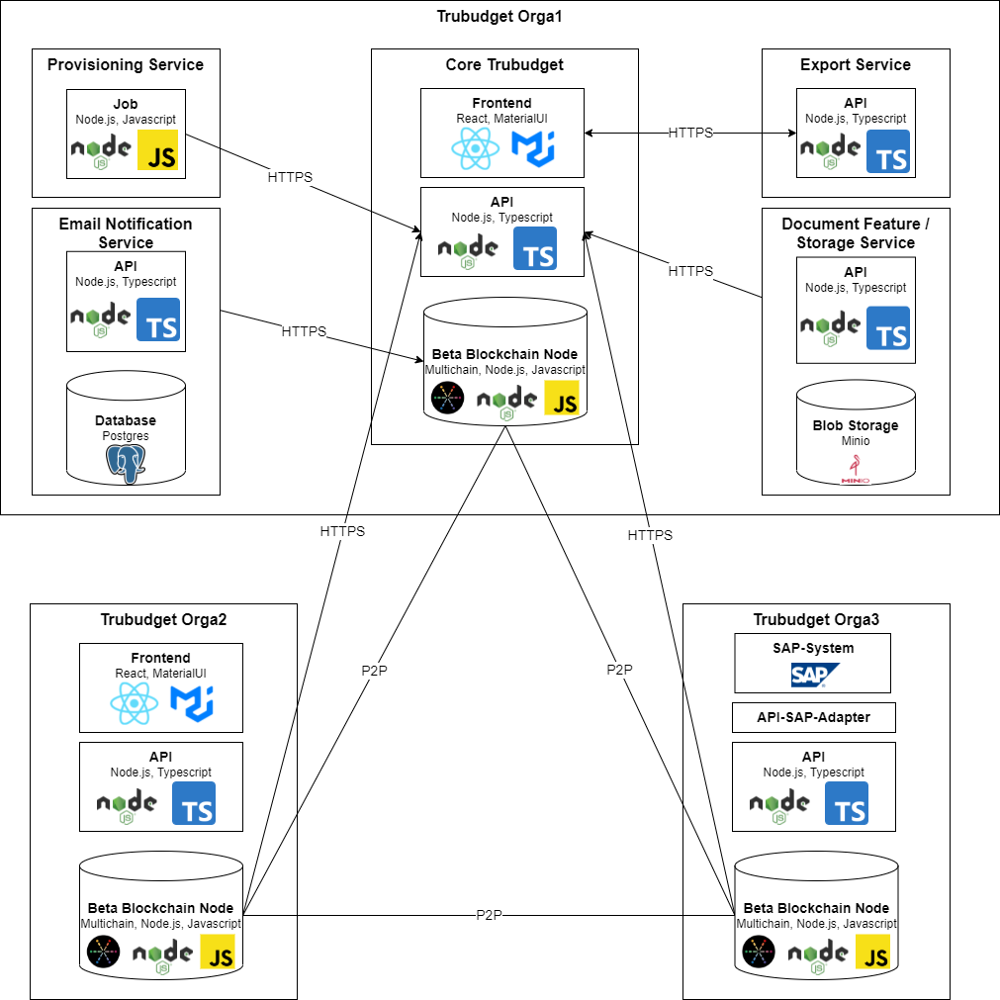

# Architecture in TruBudget

## Core TruBudget
A core TruBudget node consists of minimal components needed to function, namely a UI, an API and a Blockchain. However additional services are available to extend the capabilities of a core TruBudget node. These services are explained under [Additional Services](#additional-services).

Following diagram shows the tech stack of the core TruBudget:

## Additional Services
TruBudget offers additional services, that enhance the core TruBudget experience through additional features. These services are:

- [Provisioning Service](../../provisioning/README.md) - Used for populating TruBudget with test data
- [Email Notification Service](../../email-notification-service/README.md) - Used to enable the email-notification feature
- [Export Service](../../excel-export-service/README.md) - Used for exporting TruBudget data in an excel file.
- [Storage Service](../../storage-service/README.md) - Used to enable users to attach documents to workflowitems, which are then stored in a separate storage.

> Each service can be activated and deactivated individually.

> Starting with TruBudget 2.x, usage of the document storage is needed in order to enable the use of documents in TruBudget.

## Communication protocols in a TruBudget network
In a TruBudget network there are two different protocols used for communication:
- P2P (Multichain Protocol) - Used between nodes
- HTTP/HTTPS - Used between components

The following diagram shows the exact communication protocols used between each TruBudget component in a network.

## Data Storage
In TruBudget two types of data storage are used:
- On-Chain - Most of the persistent data such as events is stored on the blockchain using [Multichain](https://www.multichain.com/).
- Off-Chain - [Minio](https://min.io/) is used as blob storage for documents, and [Postgres](https://www.postgresql.org/) is used for emails. 

## Multiple nodes architecture
Following architecture diagram shows a network with 3 nodes from 3 different organizations including the tech stack and communication protocols.
Organizations can decide which additional TruBudget features they want to add or if they want to connect their own (external) system via TruBudget's API.

