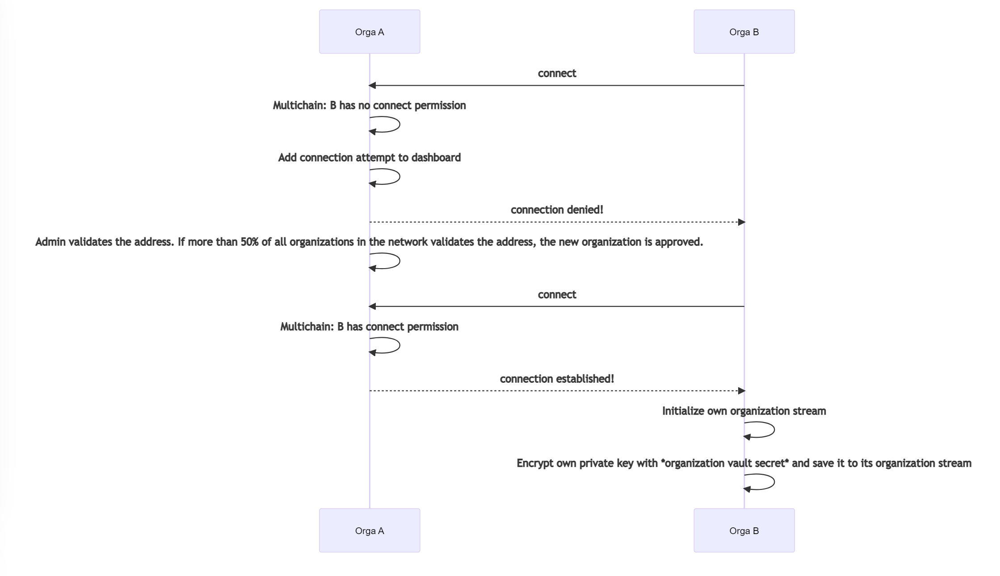
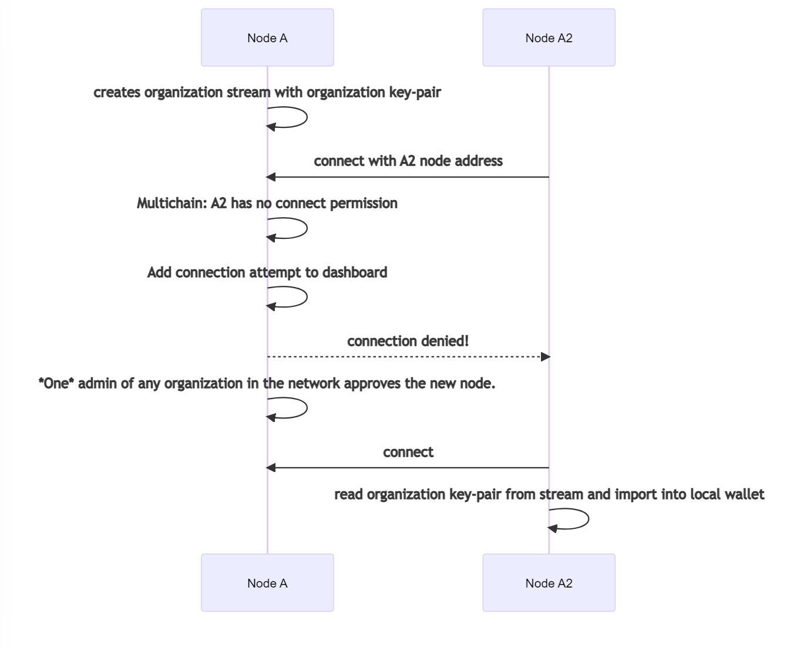

# Connection Process

This section describes how the process of joining a new TruBudget network works in detail.

The minimum components needed are an alpha node connected to an API and a beta node which wants to join the network of the alpha node.

## Table of Contents

- [Connection Process](#connection-process)
  - [Table of Contents](#table-of-contents)
  - [Alpha vs Beta Node](#alpha-vs-beta-node)
    - [Alpha node configuration](#alpha-node-configuration)
    - [Beta node configuration](#beta-node-configuration)
  - [Connect as new organization](#connect-as-new-organization)
  - [Connect as new node of an existing organization](#connect-as-new-node-of-an-existing-organization)
  - [API network endpoints](#api-network-endpoints)
    - [Connection process via REST API](#connection-process-via-rest-api)

## Alpha vs Beta Node

The first node of a TruBudget network is called `alpha node`. Every node after the first one is called `beta node`
A blockchain node defines itself as `beta node` if the environment variable `P2P_HOST` is set.

### Alpha node configuration

If a TruBudget alpha node is setup and beta nodes should connect to it in the future additional configurations must be made:

- The node must be accessible to beta nodes via `[EXTERNAL_IP]:[P2P_PORT]`.
- The API connected to the node must be accessible to beta nodes.

:::hint
After setting the `EXTERNAL_IP` and `P2P_PORT` (default: 7447) and after starting the node check if the port is open with a TCP check tool of your choice
:::

### Beta node configuration

If a TruBudget beta node is setup additional configurations must be made:

- The P2P_HOST must be set to the EXTERNAL_IP of the alpha node
- The P2P_PORT must be the same of the alpha node
- The API_HOST and API_PORT must be set to the API of the alpha node
- The MULTICHAIN_RPC_PASSWORD must be the one of the TruBudget network

:::hint
It is also possible to connect a beta node to a beta node, just make sure the additional configurations of the [alpha node configuration section](#alpha-node-configuration) are set
:::

## Connect as new organization

In this case, a new organization wants to join an already existing network. Example: Orga A already has one node in the network and Orga B wants to join.

A = Orga A
B = Orga B (new organization)

## Connect as new node of an existing organization

In this case a new node from an organization that already has a node in the network wants to join. Example: Orga A has one node in the network and a new Orga A node wants to join the network.
The main difference here is, that you only need the approval of one admin user from another node in the network.

Important: Even though the new node of the organization has its own address, only the address and private key of the already existing node is used for future transactions. It is therefore absolutely necessary that both nodes have the same ORGANIZATION_VAULT_SECRET.

Node A = first node of Orga A
Node A2 = second node of Orga A

## API network endpoints

The connection process is done using the REST API network endpoints of TruBudget.
The description of all `network` requests can be found in the Swagger documentation in every TruBudget API. If you setup the API locally, you can visit the Swagger documentation here:
http://localhost:8080/api/documentation/static/index.html#/network

### Connection process via REST API

A beta node sends a registration request (`network.registerNode`) to the alpha API automatically on startup.
The network must now vote for the new organization (`network.voteForPermission`).
If enough votes exists an organization can approve the beta node (`network.approveNewOrganization`).
After successful approval the beta node can connect to the alpha note via Peer to Peer and synchronize its data.
