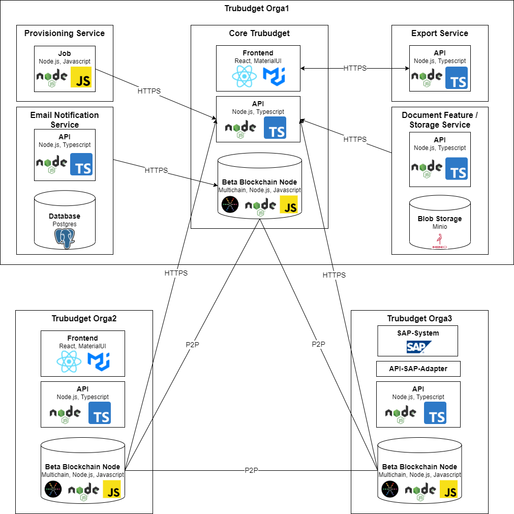

# Introduction and Basics

## Architecture

Following architecture diagram shows a Trubudget network with 3 standard nodes from 3 different Organizations.
A standard node is a Trubudget node with minimal components to function.
Organizations can decide which additional Trubudget features they want to add or if they want to connect their own system via Trubudget's api.



## Environment variables

All installation and user guides have one thing in common: They all use environment variables to customize the setup of TruBudget. To get started, you should know about the environment variables, their purpose and how to set them.

### Setting environment variables

Environment variables need to be set via the command line. Usually, they are only valid for the active session, i.e. if you close the terminal window in which you have set the environment variable and then open a new command line window, the value of the environment variable is lost.

Setting an environment variable requires different commands in Linux/OS X and Windows:

```bash
export VARIABLE="value" (Linux / OS X)
set VARIABLE="value" (Windows)
```

To check the value of a given variable, run the following command:

```bash
echo $VARIABLE (Linux / OS X)
echo %VARIABLE% (Windows)
```

:::note
In this case we assume you use the standard command line tool for Linux/OS X (which is Bash) and Windows (which is CMD).
:::

Another option to set environment variables is to use a `.env` file in the directory where the start command is executed.
Trubudget provides a default example `.env_example` file which has to be renamed to `.env` if it should be used.

### Environment Variables in TruBudget

You can find the documentation of all environmental variables in [environment-variables.md](../environment-variables.md).

If you need a `.env_example` file as a template, use the `.env_example` file in `/scripts/operation`. This file has all values pre-filled.

#### Kubernetes

| Env Variable | Required | Default Value | Used by | Description                                                                                                                                                                                                                                                                                                                                                                                                                                                 |
| ------------ | -------- | ------------- | ------- | ----------------------------------------------------------------------------------------------------------------------------------------------------------------------------------------------------------------------------------------------------------------------------------------------------------------------------------------------------------------------------------------------------------------------------------------------------------- |
| EXPOSE_MC    | no       | false         | bc      | If set to true Trubudget tries to expose it's multichain via kubernetes' ingress. First a kubernetes config file is searched in `/.kube/config`. If not found and the MC is deployed in a cluster, it is searching for the service account to get the information. After configuration the `externalip` arg is set to the ip of the service' ingress of the configured clusterSERVICE_NAME and NAMESPACE are required to access the ingress of the service. |
| SERVICE_NAME | no       |               | bc      | This variable is only required if EXPOSE_MC is set to true. It defines which service the kubernetes client should search for in the configured kubernetes cluster                                                                                                                                                                                                                                                                                           |
| NAMESPACE    | no       |               | bc      | This variable is only required if EXPOSE_MC is set to true. It defines in which namespace the kubernetes client should search for the given service                                                                                                                                                                                                                                                                                                         |

## Organizations and Nodes in TruBudget

One of the terms used most in TruBudget is _organization_. This section describes what organizations are in the context of TruBudget and how they interact with each other.

An _organization_ is a stakeholder in the funding process (e.g. Ministry of X). TruBudget is designed to connect multiple organizations together. Each organization creates their own users. Each user is associated to exactly one organization and can only login to nodes of that organization.

An organization can run one or more nodes. Each organization has exactly one wallet that can be used to vote when granting or revoking permissions to other wallet addresses, which is key to preventing a 51%-attack against the network. This means that even if one organization has multiple nodes, it gets only _one_ vote for adding new organizations to the network.

Each organization has one shared key to en-/decrypt the user data, which is set in via the `ORGANIZATION_VAULT_SECRET`. Every node of one organization needs to use the same key. If one node of an organization uses the same organization name, but a different organization vault secret, users created on other nodes cannot login on this faulty node, even though the name of the organization is the same.

### Let's look at this using some examples.

#### Two organizations: Orga1 (origin node), Orga2 (connecting to Organization 1), Each with one Node

Orga1 starts a new origin node (i.e. a new, empty blockchain) and creates a new user called Alice. At this point, Orga1 has 100% voting power in the network since it is the only node. Orga2 then connects to Orga1's node. After Orga1 approves the addition of a new node, Orga2 synchronizes the data and creates a new user called Bob. Alice and Bob can now both see the complete user list of the network (i.e. Alice and Bob), but Alice cannot login on Orga2's node and Bob cannot login on Orga1's node since they don't have the same `ORGANIZATION_VAULT_SECRET`. Each of the organizations now holds 50% of the voting power in the network.

#### Two organizations: Additional Node

Orga1 has employees in another location and decides to add another node on a server on this location. Orga1 then creates a new node with the same name and `ORGANIZATION_VAULT_SECRET`. The request for a new node of an existing organization pops up in the frontend for both organizations. The addition of a new node for one organization does not create a new wallet address and therefore also does not need more than 50% approval. Orga1 approves the addition of a new node and creates a user account for Ava. Both Orga1 and Orga2 still hold 50% of the voting power.

Ava visits the other work location to work together with Alice. She can log in on the same node as Alice, since they share the same organization vault secret.

#### Three organizations: Orga3 decides to join

Orga3 wants to join the network and connects to Orga1. The request for approval is visible on the frontends of Orga1 and Orga2. Since both of them hold 50% of the voting power, _both_ organizations need to approve Orga3 before it can join the network. After both organizations approve Orga3, the data is synchronized and Orga3 creates a new user called Charlie. Like for the other organizations, Charlie can only login on the node of Orga3. All three organizations now hold 33.33% of the voting power in the network.

## Further reading

If you want to read more about the concept of organizations, have a look at the [Multi Node Setup ADR](../developer/architecture/0010-multi-node-setup-and-user-management.md).


## Running TruBudget


### Minimum Requirements

To give your users the best experience, we have tested TruBudget with different configurations. The minimum requirements aim to provide a working environment with 50 to 100 parallel users. The recommended environment is capable of handling 100 - 400 parallel users (using Kubernetes).

If you plan to deploy TruBudget on a single VM with following services: Blockchain, API and Frontend, we recommend the following for minimum setup:
| | Minimum |
| ------- | ------- |
| CPU† | 2 vCPU |
| RAM | 8 GB |
| Storage | 10 GB |

If you plan to have more than 100 parallel users, we strongly recommend using Kubernetes. TruBudget load and stress tests are run against the minimum and recommend system requirements in a Kubernetes environment to ensure the correctness of the data below.

#### Blockchain:

|         | Minimum | Recommended |
| ------- | ------- | ----------- |
| CPU†    | 1 vCPU  | 2 vCPU      |
| RAM     | 4 GB    | 8 GB        |
| Storage | 1 GB    | 1\* GB      |

#### Frontend:

|         | Minimum  | Recommended |
| ------- | -------- | ----------- |
| CPU†    | 0.5 vCPU | 1 vCPU      |
| RAM     | 1 GB     | 2 GB        |
| Storage | 1 GB     | 1 GB        |

#### API:

|         | Minimum  | Recommended |
| ------- | -------- | ----------- |
| CPU†    | 0.5 vCPU | 1 vCPU      |
| RAM     | 2 GB     | 8 GB        |
| Storage | 1 GB     | 1 GB        |

#### Export-Service:

|         | Minimum  | Recommended |
| ------- | -------- | ----------- |
| CPU†    | 0.5 vCPU | 0.5 vCPU    |
| RAM     | 1 GB     | 1 GB        |
| Storage | 1 GB     | 1 GB        |

#### Email-Service:

|         | Minimum  | Recommended |
| ------- | -------- | ----------- |
| CPU†    | 0.5 vCPU | 0.5 vCPU    |
| RAM     | 1 GB     | 1 GB        |
| Storage | 1 GB     | 1 GB        |

#### Storage-Service:

|         | Minimum | Recommended |
| ------- | ------- | ----------- |
| CPU†    | 1 vCPU  | 2 vCPU      |
| RAM     | 1 GB    | 2 GB        |
| Storage | 1 GB    | 50\* GB     |

> † Depending on your or your provider's infrastructure, the strength of one virtual CPU might vary. The above values are based on the Intel® Xeon® Platinum 8272CL processor (second generation Intel® Xeon® Scalable processors), Intel® Xeon® 8171M 2.1GHz (Skylake), Intel® Xeon® E5-2673 v4 2.3 GHz (Broadwell), or the Intel® Xeon® E5-2673 v3 2.4 GHz (Haswell) processors.

>\* Assuming you are using off-chain-storage.