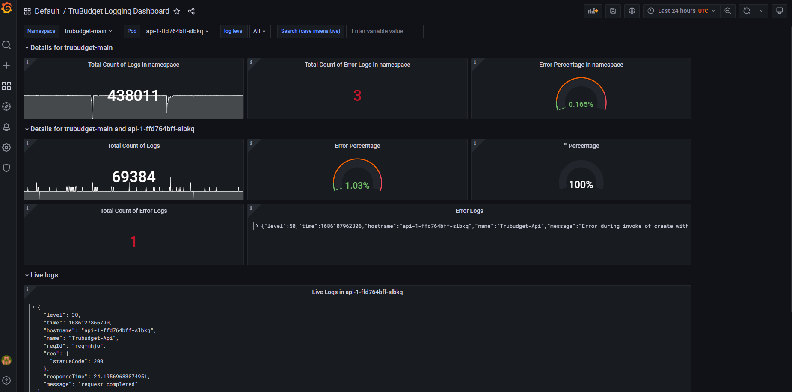

# Logging and Monitoring in TruBudget

## Logs

The API is the central part of the TruBudget application. It handles the requests from the frontend and manages the data that is written to the blockchain. Therefore logging is a crucial part of the API's operation, so that the administrator is informed of where and when errors occur.

TruBudget can be installed in 3 possible flavors (but we strongly recommend the usage of Kubernetes, which was mainly used in testing the system):

- Bare Metal - All components (Node.js, Multichain, nginx, etc.) are installed directly onto the machine that will be running the application
- Docker Compose - All parts of the application are available as docker images, so they are pulled from a registry and started by docker on the host machine
- Kubernetes - The containers with the different parts of the application are managed and orchestrated by Kubernetes

The API logs are printed to the standard output (STDOUT and STDERR) by default. This way the application does not need to worry about file paths, log rotation and other operations topics. We have compiled a list of recommended practices for handling the logs for each installation type.

### Bare metal

As stated above, the API logs are printed to STDOUT/STDERR, which means that they are just displayed to the console. We therefore need an application that can take care of the node process and re-route the logs for us. Luckily, there are several applications that are capable of doing exactly that. One of them is PM2, which we will describe here shortly.

PM2 is an application that handles node processes for you and restarts it after a crash. PM2 can be installed via the following command

```bash
npm install -g pm2
```

It offers a wide range of plugins called "Modules" that can be installed via PM2 directly. One of these modules is called "pm2-logrotate" which can be used to rotate logs (e.g. split them into chunks of certain size or create separate files for each day) and the command to install it is simply

```bash
pm2 install pm2-logrotate
```

After [setting up](https://github.com/keymetrics/pm2-logrotate) pm2-logrotate (if needed) you can run the api with pm2

```bash
cd api
pm2 start dist/index.js
```

This is just an example. Please refer to the [official documentation](http://pm2.keymetrics.io/) for more information.

### Docker Compose

When choosing the Docker Compose setup, all messages that are printed to STDOUT/STDERR are available via the `docker logs` command. On UNIX systems, the logs are available on `/var/lib/docker/containers/[container-id]/[container-id]-json.log` and can be processed with applications like Logrotate.

Another possibility is to use the EFK stack which will be described below.

### Kubernetes

When operating the application via Kubernetes the logs of the TruBudget components are available via the `kubectl logs -f <pod_name>`.


## Logging and Monitoring Tools
Various logging and monitoring tools can be used with TruBudget, in order to collect, parse and visualize logs and metrics. Setting up monitoring and logging and choosing the right tools is highly dependent on the underlying infrastructure. For our infrastructure we decided for the Prometheus/Loki/Grafanastack. However, other technologies are also a good option, such as the EFK Stack, which is described below.

### Prometheus/Loki/Grafana

- [**Prometheus**](https://prometheus.io/docs/introduction/overview/) is used in collection of metrics from the TruBudget containers.
- [**Loki**](https://github.com/grafana/loki) is used in collection of logs.
- [**Grafana**](https://grafana.com/grafana/) is used to visualize the collected metrics and logs.

Following is an example of how a fully configured Grafana dashboard could look like.



### The EFK Stack

The EFK stack consists of the following components:

- [Elasticsearch](https://www.elastic.co/elasticsearch/) - A backend for indexing and persisting data
- [Fluentd/Fluentbit](https://www.fluentd.org/) - An aggregator for log files
- [Kibana](https://www.elastic.co/kibana/) - A frontend to visualize logs and work with them

The EFK stack is a powerful set of software that enables advanced administration of log information. The logs are aggregated from all sources via Fluentd or Fluent Bit, sent to Elasticsearch and can then be viewed in Kibana. Fluentd and Fluent Bit are similar applications that perform similar tasks, but Fluentd is more versatile and heavyweight whereas Fluent Bit is lightweight and not as rich in functionalities.

#### EFK & Docker Compose

In the Docker Compose setup, we have mainly two different options of getting the logs of the containers:

1. Use the "Tail" input plugin and select the path of the docker logs as input
2. Use the "Fluentd" log plugin that is built into Docker that automatically posts the log entries to the TCP port 24224 and then use the input plugin "Forward" to connect to the port 24224 and receive the log messages.

Elasticsearch and Kibana can then be installed in Docker containers or locally.

#### EFK and Kubernetes

The Helm chart for Kubernetes can be configured such that a Fluent Bit pod is created on every node (see the reference architecture). The Fluent Bit pod then gathers all logs from the other pods on the node, adds some Kubernetes meta data (like pod names, cluster name, etc.) and sends it to a defined destination. In the reference architecture this destination is Fluentd, but if no further processing is required, the log data can be sent to Elasticsearch directly.


## Logging Guidelines and information

This section contains guidelines and standards regarding logging and should be expanded as the application matures.

### Logger - Pino

The logger used in the application is called "Pino" and you can find the documentation [here](https://github.com/pinojs/pino). Why was Pino used instead of Winston? The reason is that Pino is compatible with Fastify, whereas Winston is not (at least not out of the box).

### Logging - format

Pino supports several log levels (from `trace` to `fatal`). To make sure that the relevant information is in place, each log entry should include an object containing meta data if possible.

#### Error

The call of the "error" level should always contain data of the situation as an "err" object. Example:

```bash
logger.error({ err }, "Stream not found.");
```

where `err` is the object containing information on the root cause of the error.

### Environment variables

There are two settings of the Pino logger that are set via environment variables.

- Set `PRETTY_PRINT` to "true" to enable pretty printing
- Set the log level via `LOG_LEVEL`. This will setting will be used for every service by default.
  The possible values are: "trace", "debug", "info", "warn", "error" and "fatal".

- The developer and operation startup scripts control the log level for each service specifically (see .env.example files in scripts folder). Following Variables can be modified there:
  - Set the log level via `API_LOG_LEVEL`. Controls Log Level for API.
  - Set the log level via `BLOCKCHAIN_LOG_LEVEL`. Controls Log Level for the Blockchain
  - Set the log level via `EXCEL_LOG_LEVEL`. Controls Log Level for Excel Service
  - Set the log level via `EMAIL_LOG_LEVEL`. Controls Log Level for Email Service
  - Set the log level via `PROVISIONING_LOG_LEVEL`. Controls Log Level for Provisioning
  - Set the log level via `STORAGE_LOG_LEVEL`. Controls Log Level for Storage Service
