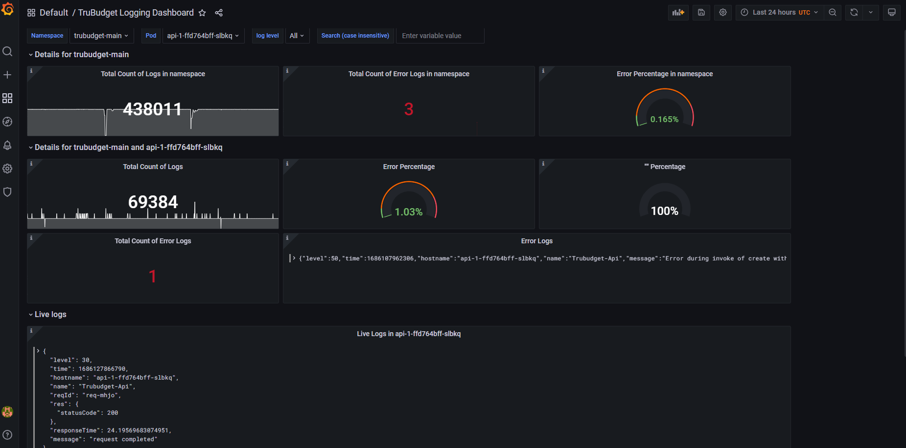

# Monitoring TruBudget
## Monitoring containers/components
Various monitoring tools/stacks can be used with TruBudget. We are using Prometheus/Loki/Grafana. Below is the information about how we are using them to monitor TruBudget metrics and logs.

### Prometheus/Loki/Grafana

Our infrastructure uses the following stack:

- **Prometheus** is used in collection of metrics from the TruBudget containers.
- **Loki** is used in collection of logs.
- **Grafana** is used to visualize the collected metrics and logs.

We have set up our own Grafana dashboard, which can be seen in the picture below.

While we are using first row for monitoring a specific deployment, rows below are used to monitor (live) logs from individual containers.

### EFK Stack
As an alternative to Prometheus/Loki/Grafana, EFK Stack is also an option for Kubernetes based infrastructure. We have included more information about EFK Stack and hints on how to set it up under [EFK Stack](./logging.md#the-efk-stack).

### Other alternatives
Setting up monitoring and choosing the right monitoring tools is highly dependent on the underlying deployment infrastructure. For our infrastructure we concluded the Prometheus/Loki/Grafana to be the best option. You can checkout the [Logging](./logging.md) section for more information about how logging works in TruBudget.