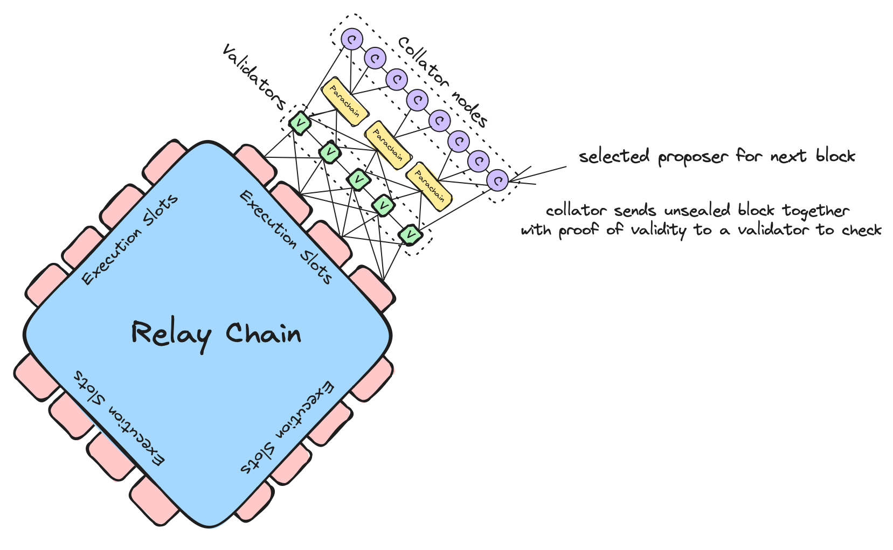
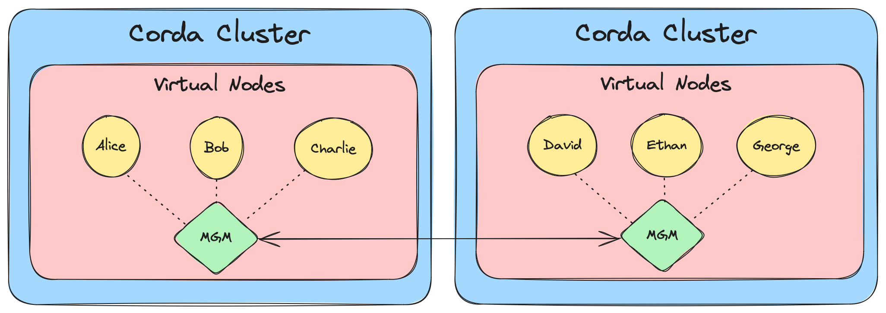
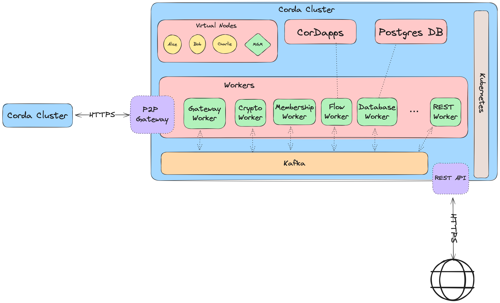

# Research on potential DLT replacements
## Index
- [Introduction](#introduction)
- [Motivation](#motivation)
- [Technologies in Consideration](#technologies-in-consideration)
- [Requirements](#requirements)
- [Blockchain Frameworks](#blockchain-frameworks)
  - [Celo](#celo)
  - [Polygon](#polygon)
  - [Cosmos](#cosmos)
  - [Polkadot and Kusama](#polkadot-and-kusama)
  - [Hyperledger Besu](#hyperledger-besu)
  - [Hyperledger Fabric](#hyperledger-fabric)
- [IPFS and OrbitDB](#ipfs-and-orbitdb)
  - [IPFS](#ipfs)
  - [OrbitDB](#orbitdb)
- [ImmuDB](#immudb)
- [Corda R3](#corda-r3)
## Introduction

TruBudget utilizes Multichain as its core component within its persistence layer. Multichain is not only a blockchain but also a Distributed Ledger Technology (DLT), which brings a different data architecture than from conventional databases. TruBudget leverages the immutability and data verifiability through cryptography provided by DLTs. As DLTs are distributed systems, availability, consistency, and fault tolerance are essential considerations when utilizing such technologies.

## Motivation

During this research, we are taking a look at possible alternatives to Multichain. This is not with the intention of replacing Multichain right away, but more as a reference point to compare similar technologies, their suitability and their advantages/drawbacks.

Currently what drives this motivation is minimal company and community support of the Multichain product. This sets an unclear path in terms of future-proofness.

With this research our goal is to

- Find a product that has more company and community support (Future-proofness)
- Potentially reduce infrastructure complexity, if possible

## Technologies in Consideration
Following is a list of the technologies that are considered to be further investigated during this research:

- Celo
- Polygon
- Cosmos
- Polkadot and Kusama
- Hyperledger Besu
- Hyperledger Fabric
- IPFS and OrbitDB
- ImmuDB
- Corda R3

## Requirements
Following are the requirements to take into consideration either when looking for new technologies (the ones not mentioned above) or when during the investigation of a certain technology.

- **Excellent documentation.**
- **Recognition in the community in terms of scalability and performance.**
- **Active product community and development with clear visions and road-map for the future. It is important that the product is well-established in the community, and does not go under frequent breaking changes.**
- **Possibility to use Javascript/Typescript, as this is the preferred language due to our stack choice.**

> These requirements can be refined and subject to change during future discussions.

## Blockchain Frameworks
### General Information about public blockchains
Before going into explanations of certain blockchain frameworks that are public below, we do not really recommend usage of these for a couple of reasons.

First of all, public blockchains are, as the name suggests, developed for public usage under the Web3 vision. These chains are not feature optimised for enterprise and the enterprise use cases. They lack key features, which makes them not so great fit for private usage such as identity management and privacy/permissioning on-chain. Public chains allow creation of key pairs/addresses anonymously (anyone can create as much addresses as they want), thus identity management is not really a considered feature in such chains. Also Web3 or public solutions as a persistence layer **does not scale well**.

Public blockchains are categorized in different layers, which have different purposes such as interoperability and scalability. 

- **Layer-0 protocols** are used mainly for interoperability purposes. Chains created on Layer-0 protocols can seamlessly work with Layer-1 chains. Thus Layer-0 protocols are used to create an ecosystem of networks of independent parallel blockchains.
- **Layer-1 protocols** provide the infrastracture for the blockchain network. They usually come with a chosen consensus mechanism and is the foundation for many of the leading public blockchain networks as well as decentralized Apps and protocols. As the Blockchain Trilemma shows, Layer-1 protocols provide strong decentralization and security, but falls short when it comes to scalability.
- **Layer-2 protocols** are used for scalability, which is what the Layer-1 protocols generally lack. Layer-2 chains are considered off-chain network and usually runs on top of an existing Layer-1 chain, thus inheriting the security features. Layer-2 chains can efficiently process transactions at higher throughput.

For Layer-1 and Layer-2 chains, if one has to create a private deployment, this usually happens via forking an existing chain. Forking means copying the whole chain state up until a chosen block number. A forked chain will contain the state of the main chain. This is not really the best option since it increases the required storage size just to be able to run the chain. One solution is to fork from the genesis block, but then this possibly results in missing certain security and chain updates introduced in certain block numbers over the chain's lifetime.

> e.g Ethereum blocksize is limited to 1 MB. Average block size on the network is 0.16 MB. Latest block at the time of writing this is 19069272. A full sync would require a minimum of at least 1TB storage.

It's important to keep these in mind when reading the below products.

### Celo
Celo is a Layer-1 EVM Compatible blockchain product developed by cLabs.

To spin up a running Celo node, the Celo mainnet usually needs to be forked. The drawbacks of forking is mentioned above.

However there is another problem with Celo, that makes Celo not a suitable candidate. The team behind Celo has submitted a [proposal](https://celo.stake.id/#/proposal/116) on July 2023, which proposes to transition Celo from Layer 1 chain to a Ethereum Layer 2 solution. Proposal has been accepted by the community, thus confirming the transition plans. There are no set end dates on sight for this migration. According to the proposal, this change affects the validator nodes and developers, meaning that developing with Celo will require obvious refactoring efforts in the future as well as possible architectural replanning.

This makes Celo an unfit candidate to build an architecture around.

### Polygon
Polygon is a Layer 2 chain on top of Ethereum. It offers two options for developers:
- Building decentralized apps on top of the Polygon mainnet
- Building application specific ZK (Zero-Knowledge) Layer 2 chains on top of Ethereum.

As the latter is more fitting, Polygon offers Polygon CDK for building such chains.

There are two possible chain setups:

#### Validium
Validium is a scaling solution that store transaction data off-chain. Hosting a validium network requires 6-7 nodes for different purposes, and 3 postgres instances. Docker-compose file for a functioning Validium network can be checked here: [docker-compose](https://github.com/Snapchain/zkValidium-quickstart/blob/main/docker-compose.yml#L12)

#### Rollup
Rollup is a scaling solution, which rolls up multiple transactions into batches which are eventually committed to the layer 1. This improves network speed. Similar to Validium, setting up a Rollup network needs multiple node deployments as well as db instances.

Both of these setups depends on a Layer 1 as a base node. Developing a Layer-2 Chain automatically means that one has to also use a Layer-1 solution (in this case Ethereum). 

Generally Layer-2 solutions improve Layer-1 chain scalability, but do not really solve the identity management and privacy/permissioning issues.

It is open for discussion, but we do not recommend Layer-2 chains because of the complexity they introduce in comparison to other Layer solutions.

### Cosmos
Cosmos is a Layer-0 solution built for chain interoperability in mind. For developing application specific chains, Cosmos ecosystem offers Cosmos SDK. One advantage of Cosmos is that it also offers to build permissioned blockchains, which usually is not a feature offered by other public blockchains.

#### Key features
- Can build permissioned blockchains.
- Blockchains are built out of modules.
- Application-specific blockchains offer more freedom to make design choices for product optimization.
- Good documentation
  - Documentation also contains ADRs.

#### Key concerns
- Requires knowledge of Go.
- Just like other public projects, it's support and existence is heavily tied to cryptocurrency market performance.

### Polkadot and Kusama

Polkadot is an open-source sharded multichain protocol with a focus on enabling cross-blockchain transfers of any type of data or asset, thereby allowing blockchains to be interoperable with each other. Polkadot describes a format for a network of blockchains, thus making it a layer-0 metaprotocol.

Polkadot protocol connects the public and private chains (these are called Parachains) through its Relay Chain.  Relay Chain is the central chain in the Polkadot network for coordinating the whole ecosystem of parachains. 

Kusama on the other hand is used as sort of a standalone canary network for the Polkadot for the experimentation and early-stage deployment purposes. However Polkadot can process more transactions per second, and is more suitable as a enterprise-level deployments.

Both Polkadot and Kusama use Substrate SDK as primary blockchain SDK to create parachains. All chains created using Substrate SDK are seamlessly compatible with Polkadot and Kusama. For these reasons, we will mostly focus on Substrate SDK.

A short overview of Polkadot Architecture:

#### Substrate SDK

Substrate is a powerful blockchain development framework that allows developers to create blockchain solutions, including private blockchain networks.

#### Key features
- **A range of pre-built modules and libraries**
  - These modules and libraries simplify and quicken the development process.
- **Allows customized blockchains and private networks**
- **Private chains are compatible to deploy on public Kusama and Polkadot networks.**
- **Active developer community and regular updates**

#### Key concerns
- **The offered pre-built modules and libraries might not provide exact level of customization needed for specific use cases or industry level requirements.**
  - This can either result in changing Substrate codebase or development of custom modules, which in both ways increase development time and effort.
- **Designed for scalability, but might fall short in comparison to other blockchain frameworks, which offer higher transactions per seconds and a native private network support.**
- **Offered security might end up not being sufficient for specific use cases.**
- **Uses Rust as the framework language**
  - Rust as a language is challenging to learn due it's ownership model in memory management.
  - This can make onboarding and finding other developers harder.

We do not recommend Polkadot/Kusama as a replacement due to Substrate SDK being Rust based. Being locked into Rust as a language, would only make future onboarding of developers harder, as well as finding suitable replacements. However if decided that this is not an issue, then Polkadot could be the only public blockchain solution that we might recommend.

### Hyperledger Besu

More complicated setup for permissioned networks. Ethereum data storage has two possibilities: 
- Smart contract space
- Transaction Inputs

#### Smart contract space

### Hyperledger Fabric
TBD

## IPFS and OrbitDB
### IPFS
IPFS is a distributed file storage protocol that allow nodes to store and serve files in a peer to peer network.

#### Key features
- **IPFS is public by nature.**
- **There are certain developments to make private IPFS networks.**
  - IPFS Cluster
  - IPFS Private swarm keys
- **It uses content addressing, where the key is derived from the content.**
  - A Content ID is generated via cryptographic hashing. This way content is immutable, because any change in content, changes the CID as well. This provides the verification of data integrity.

#### Key Concerns
- **Files have to be pinned to persist in an IPFS Network.**
  - When a file is not pinned by any node, that file will be stored in the cache of the node. Then the file will be deleted during the next run of the IPFS Garbage Collection. Any mistake of not pinning the file, or during, might result in a data loss.
- **Scalability and performance is a concern in IPFS.**
  - P2P networks usually thrive on higher node counts, as the files are distributed in a higher range of nodes, which increases the data availability. Downloading seems to be much slower in smaller networks, although performance metrics concerning private networks seems to be lacking.
- **Lack of consensus.**
  - IPFS is made to be a P2P file sharing/storage technology, thus it does not provide a consensus mechanism, which is crucial for the data consistency in a data sensitive systems.

### OrbitDB
OrbitDB is a distributed P2P database built on IPFS for data storage and Libp2p pub/sub for syncing databases with peers.

#### Key features
- **It is an eventually consistent database.**
  - This means that immediate data consistency is not promised, thus at a given time, two nodes might not have the same data.
- **It offers multiple database type options.**
  - Key-Value
  - Event
  - Document
  - Count
- **Provides an immutable log with traversable history.**
  - When doing data operations immutability is abstracted, meaning that data appears as mutable, however, independent of the database type, OrbitDB holds a log of the every data operation performed in a log, which is called OPLOG.
- **Offers conflict-free database merges.**

#### Key concerns

- **OrbitDb is not considered production ready.**
  - They are still swapping some underlying deprecated library (js-ipfs) with a library called Helia.
  - Next version would include breaking changes. 
  - No planned release date for the new version yet. 
  - Progress can be tracked via merged branches as the project is open-source, but there are no devlogs or progress updates.
- **Poor documentation. Setup for more complicated use-cases is not intuitive.**
  - Documentation is lacking and not sufficient.
  - There is not much (if all) resources online, other than spinning up a very basic network example.
  - Trying to find a solution for a problem might cost a lot of time.
  - Example: Trying to set up a private network is a lot painful than doing so with a plain IPFS network, since js-ipfs (the library OrbitDB uses for now) does not read swarm keys from the file hierarchy. This means that there has to be additional classes and logic written to spin up a swarm network with a private key. What most documentation showed on the internet for js-ipfs however did not work with the OrbitDB.
- **Lacks the data validation and consensus mechanism.**
  - There are no consensus between nodes to make it up for the eventual consistency. Data consistency is a risk.
- **Compatibility and breaking changes.**
  - Upgrade from 1.0 had many breaking changes.
  - Could potentially lead to an unwanted technical debt and refactoring efforts with it in the future.
- **It also includes general concerns of the IPFS, since it is just an additional logical layer implemented on top of the IPFS.**

## ImmuDB

TBD

## Corda R3

Corda is an open-source market leading DLT solution. We are here strictly evaluating the Corda 5, which is the newer and evolved version, which improves upon the Corda 4 with an architecture change. Previously Corda 4 was divided into Community and Enterprise Editions. This does not seem to be the case for Corda 5, as it is under Apache 2.0 License.

### Infrastracture

Corda 5 runtime consists of a distributed architecture, which is similar to a microservices approach. There are two terms, which are architecturally relevant:
- Worker Processes
- Virtual Nodes

**Worker processes** are stateless services and each have their unique responsibilities. As they are stateless, they scale horizontally.

**Virtual nodes** are a representation of identities on a network of application users. Virtual nodes are bound to their Corda deployments, meaning that they exist within a single Corda cluster and network. This means same name can exist in different clusters and networks, however the virtual node is abstracted from the runtime, thus through the Network Manager (MGM) a Corda deployment can support other networks' virtual nodes.

> Corda recommends the deployment of runtime environment as a Kubernetes Cluster with Helm charts, and thus provides workers as container images.

Minimal setup of the architecture is as follows with suitable replicaCounts for worker processes configured:

#### Key features
- **Corda is a very well established product and has a large community.**
- **Built for enterprise, thus for scalability and performance.**
- **One of the big players in the enterprise scene.**
- **Production ready on an enterprise level.**
- **Corda 5 is open-source.**

#### Key concerns
- **More complicated setup and infrastracture.**
  - If scalability is not concerned, it might be an overkill.
  - Infrastracture requires more deployments such as a Postgres Database and Kafka, along with additional services.
- **Uses Java/Kotlin. This clashes with our Javascript preference.**
