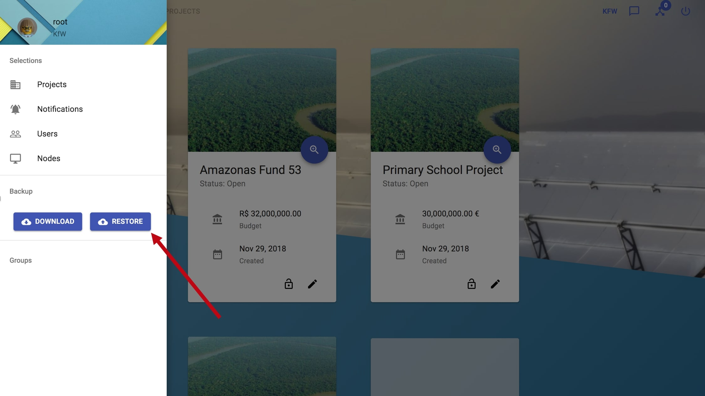

# Backup

Only the admin user (root) is allowed to create and restore backups of blockchain states.

While creating or restoring a backup the blockchain needs to be stopped. **During that time errors might pop up in the frontend**. Furthermore the MULTICHAIN_RPC_PASSWORD of the Blockchain Backup needs to be equal to the password that is currently in use, that should be the case using the default configuration.

### Create a Backup

**Description:**

These section describes how to create a gzip file which contains the current blockchain state.

**Instructions:**

1. Login into the frontend using the `root` user
1. Click the button in the upper left corner to open the side-navigation-bar
1. Click on the `Download` Button to create a backup of the current blockchain state
1. Once the backup.gz file is downloaded you can rename it to whatever name you want

:::note

- Only the `root` user is allowed to restore backups of blockchain states.
- The MULTICHAIN_RPC_PASSWORD of the Blockchain Backup needs to be equal to the password that is currently in use.

:::

### Restore a Backup

**Description:**

These section describes how to restore a blockchain state with an backup file created/downloaded before.

**Instructions:**

1. Login into the frontend using the `root` user
1. Click the button in the upper left corner to open the side-navigation-bar
1. Click on the `Restore` Button
1. Select the backup that you want to restore
1. When the backup is successfully restored you will be logged out
   You are now able to login with whatever user you want and should see the projects & subprojects from your backup.

:::note

- Only the `root` user is allowed to restore backups of blockchain states.
- The MULTICHAIN_RPC_PASSWORD of the Blockchain Backup needs to be equal to the password that is currently in use.
- During restoring errors might pop up in the frontend of other users connected
- After successfully restored the blockchain state, the user is logged out.

:::
