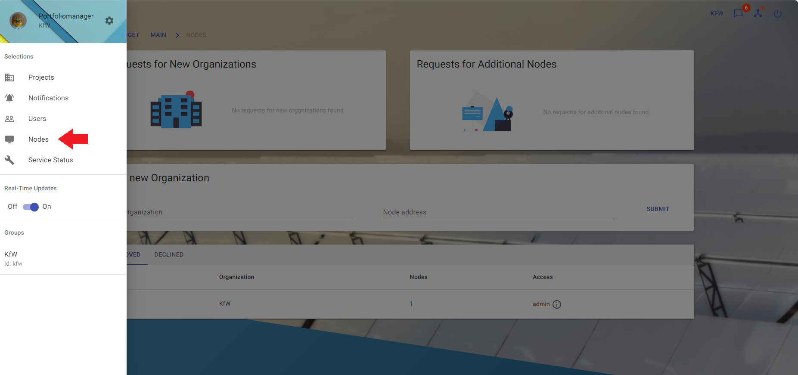
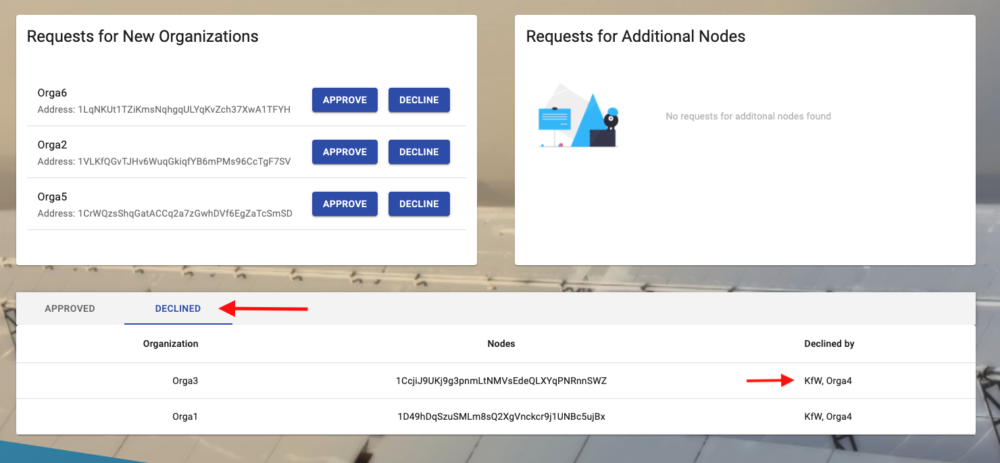

# Nodes

The "Nodes" section is used to approve other organizations and nodes. An organization can have many nodes. If a new organization wants to join the network all organizations in the network may vote for this organization. After 50% voted for the organization to join the network an organization can approve it.

## View Nodes

**Description:**

In the top cards "New Organizations" and "New nodes for existing organizations" organizations or nodes waiting for approval are shown. If a request is not going to be approved it can be declined and will disappear from the list.

The main table shows all organizations and nodes of the current network.
In the "Approved" tab a list of nodes that were approved and added to the network is displayed. Each organization has one entry in the list, showing the number of nodes the organization has and which access the nodes have. Each table entry can be expanded in order to view more information regarding each node in the organization. Each node has a specific address, a connection status that shows if the node is still connected to the network and a timestamp that is updated every 24h specifying when the node was last seen.

The second tab shows the nodes that were declined by the current organization while also mentioning what organizations declined the node.

**Instructions:**

1. Click the button in the upper left corner to open the side-navigation-bar
2. Click the "Nodes" menu point

3. Click the buttons to "approve" or "decline" requests
   

1. On the "Approved" tab, click the arrow icon to expand the row and see more details about the organization's nodes

1. On the "Declined" tab, see the nodes declined by your organization. It is also visible what other organizations also declined the nodes.

