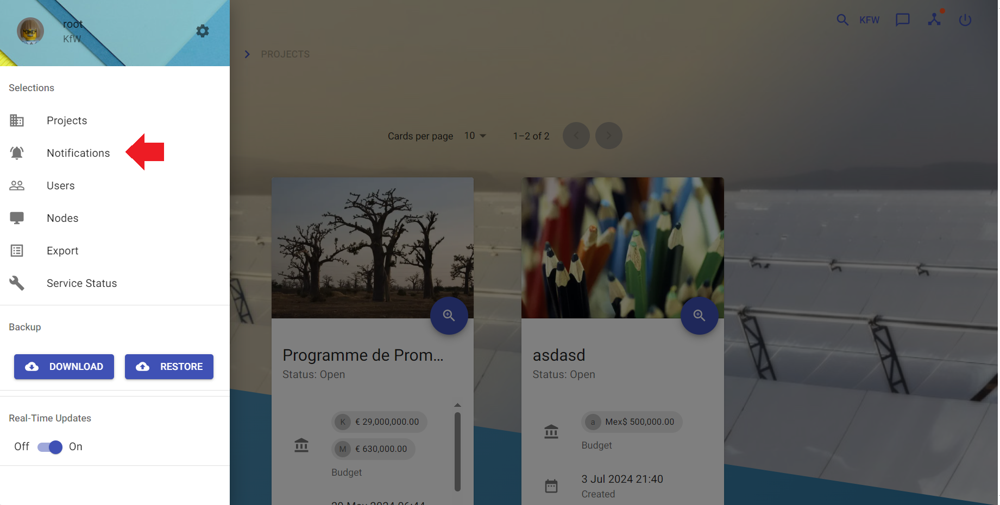

# Notifications

Notifications are helpful to recognize or to inform about changes.

In case of following actions a user gets notified:

- assign a user/group to a project,subproject or workflowitem
- close a project,subproject or workflowitem
- update a subproject or workflowitem

## View current notifications

**Description:**

View all notifications the current user has.

**Instructions:**

1. Click the button in the upper left corner to open the side-navigation-bar
2. Click the "Notifications" menu point

:::note

- An alternative way to view all notifications is to click the chat-bubble-button in the upper right corner.
- Clicking on a notification will mark it as read
- Clicking on the "READ ALL"-Button mark all notifications currently shown.
- Clicking on the magnifier icon opens the site where the change has happened
- If the current user has no permissions to view the changed item the information "No permissions to see further details"
  will be shown next to the notification message

:::
