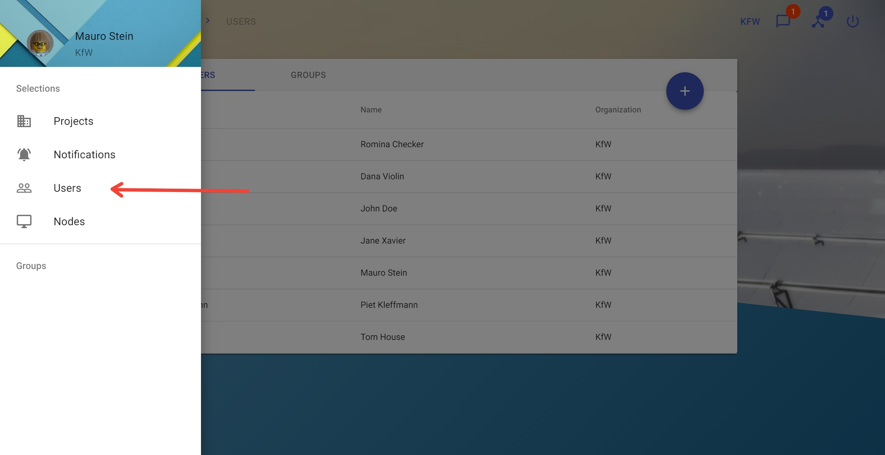
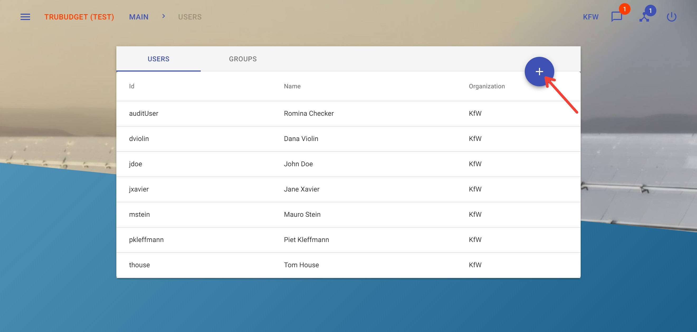
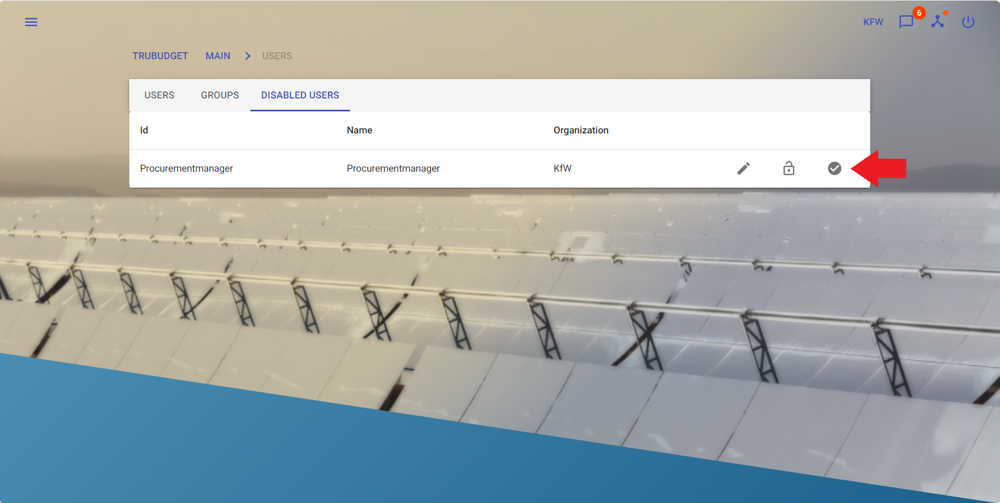
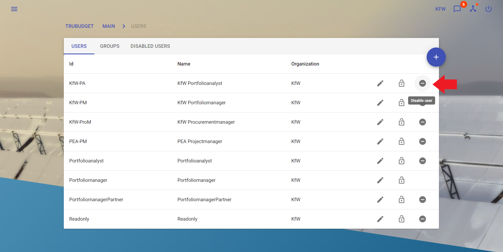

# User

With **Users** an organization can grant an entity access to the Trubudget-application. New users only have access to the Trubudget-application without permissions to see any project. All permissions (e.g. view a project, view a subproject,...) have to be granted separately by the administrator. More details about the permission model can be found in the [Permissions section](./permissions.md)

Users and Groups can be viewed and created in the "Users" section which can be found in the sidebar navigation.

## View Users

**Description:**

View all users.

**Instructions:**

1. Click the button in the upper left corner (hamburger menu) to open the side-navigation-bar
2. Click "Users" Selection

:::note
Users can only be viewed or created by an administrator.
:::

## Create User

**Description:**

Create a new User.

**Instructions:**

1. Click the button in the upper left corner (hamburger menu) to open the side-navigation-bar
2. Click "Users" Selection
3. Click the blue "+" button on the right to open the "Add User" dialog

4. Fill in the required fields:

   - "Full Name": Name displayed to other users
   - "Username": ID of the user e.g. for login
   - "Password": Password of user

5. Click the "Submit"-button to create and save the new user.

Once a user is created you can grant and revoke administrator permissions for the user, more details can be found at [admin-permissions](./permissions.md#admin-permissions).

:::note

- Only an administrator can create users of his/her organization!
- Users can be neither edited nor deleted.

:::

## Change a user's password

**Description:**
A user's password can be changed by anyone who has the permission `user.changePassword` for a given user. Starting with version `v1.1.0` every user is granted the permission to change his/her own password upon creation . If another user should be able to change a user's password (like an administrator), this permission needs to be granted via the `/users.intent.grantPermission` endpoint. The `root` user can always change passwords and grant the necessary permissions.

Examples:

- User `mstein` wants to change his own password, but does not have the permission to do so. The `root` user needs to grant `mstein` the permission `user.changePassword`. Once this is done, `mstein` can change his own password.
- User `mstein` is an administrator and should be able to change the password of `dviolin`. The `root` user needs to grant the `user.changePassword` permission to `mstein` for `dviolin`. After that, `mstein` is able to change the password of `dviolin`.

**Instructions:**

1. Click the button in the upper left corner (hamburger menu) to open the side-navigation-bar
2. Click "Users" Selection
3. Click the "Edit" button (looks like a pen) next to the user you want to change the password for
4. Type in _your_ password
5. Type in the new password for the selected user
6. Re-type the new password to confirm it
7. Click "Submit" to save the new password

:::note
To change a user's password, you must type in _your_ password first
:::

## Enable User

**Description:**

Enable disabled User.

**Instructions:**

1. Click the button in the upper left corner (hamburger menu) to open the side-navigation-bar.
2. Click "Users" Selection.
3. Click "Disabled users" tab
4. Click the "Restore user" button (looks like a white check mark symbol) next to the user you want to enable.

5. A confirmation dialog will be show. Click "Disable user" to confirm the activation.

:::note
Only a user with the `user.enable`-permission can enable users of his/her organization!
:::

## Disable User

**Description:**

Disable an User.

**Instructions:**

1. Click the button in the upper left corner (hamburger menu) to open the side-navigation-bar.
2. Click "Users" Selection.
3. Click the "Disable user" button (looks like a white minus symbol) next to the user you want to disable.

4. A confirmation dialog will be shown. Click "Disable user" to confirm the deactivation.

:::note

Only a user with the `user.disable`-permission can disable users of his/her organization!
When disabled user tried to log in a "Login ID is disabled" message will pop up.

:::
