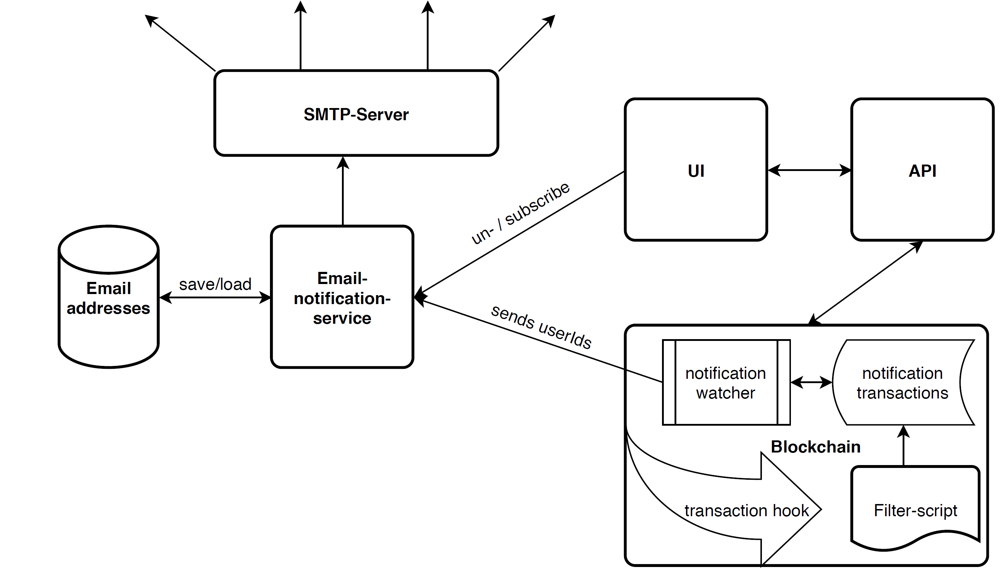

# Email-Notification-Service

The email notification service is responsible for saving/deleting email addresses per Trubudget user in a connected
database. These email addresses are used to send configurable notifications to a connected SMTP server. If database and
SMTP server are connected the notification.send endpoint can be used to send a user id. The database is checked if a
email address is linked to the passed user id. If so a notification is sent.

## Database Configuration

This project is using knex to connect to the database where user email addresses are stored. Knex makes it possible to
choose from a pool of supported databases.
Supported databases are:

| Database                   | Driver  |
| -------------------------- | ------- |
| PostgreSQL/Amazon Redshift | pg      |
| MySQL/MariaDB              | mysql   |
| SQLite3                    | sqlite3 |
| MSSQL                      | mssql   |

To install the driver for your database type in following command:

```
npm install <Driver> --save
```

## Architecture

As shown in the architecture section below, a script shall filter every transaction. This script is
called `multichain-feed` and is part of the mono repository of Trubudget. The script filters transactions after
notifications and saves them locally named with a timestamp as json files in the `/notifications` folder of the
blockchain application.
An external process called `notification-watcher` watches the notifications folder and sends the user's ids parsed from
the saved transactions via http request to the email service using the `notification.send` endpoint.
The email service checks if the connected database includes an email address for the passed user id. If an email address
is found a notification is sent to the configured SMTP host.
Subscribing/unsubscribing to the email notification service can be handled by the user profile of the Trubudget frontend
or by using the user.insert/user.delete endpoint of the email service.



## Email-Service

## Getting Started

The easiest way to get started is to use our `docker compose` setup which starts the whole TruBudget
application including all email components (that means you need to
install [Docker](https://www.docker.com/community-edition#/download)).

```bash
cd docker-compose
cp .env.example .env
docker compose --project-directory . -f blockchain/docker-compose.alphanode.yml -f api/docker-compose.yml -f frontend/docker-compose.yml -f email-notification-service/docker-compose.yml up
```

The pre-set cluster contains:

- 1 Alpha-Node
- 1 Alpha API connected to Alpha-Node
- 1 Frontend connected to Alpha-API
- 1 Email-Service
- 1 Email-Database (Postgres)

When started, the Email-Service sends email notifications to the configured SMTP-host. The default configuration is:

- SMTP_HOST: host.docker.internal(localhost)
- SMTP_PORT: 2500

To configure another database type for storing the user email addresses check out
the [database configuration section](#database-configuration)
If a local SMTP mail server for testing purposes is needed [mailslurper](https://github.com/mailslurper/mailslurper) can
be used

### Environment Variables

To check the possible configurations in the email-notification service check out
the list of [Environment Variables](./environment-variables.md)

## Enable email notifications

If `EMAIL_SERVICE_ENABLED` is set to "true" and `EMAIL_HOST` and `EMAIL_PORT` are set too the multichain-feed is attached to the multichaindaemon and the notification-watcher starts watching the `NOTIFICATION_PATH` for new incoming notification transactions. In other words The blockchain starts the background processes to send user ids to the email-notification service. `EMAIL_SSL` is a flag to define if the connection of the blockchain application and the email-service shall be https(true) or http(false).

## Disable email notifications

To disable email notifications for blockchain simply set the `EMAIL_SERVICE_ENABLED` to "false" or unset it.
If disabled the multichain-feed is not applied to the multichain-deamon and notifications are not created.

**Hint:** To prevent the frontend requesting an email-notifcations readiness call simply unset the email notification
service environment variable in the frontend. More details can be found in
the [frontend documentation](../frontend/README.md#email-notifications)

## Endpoints

| Method | Endpoint           | Description                                                    |
| ------ | ------------------ | -------------------------------------------------------------- |
| GET    | /readiness         | Checks if email service and its database is ready              |
| GET    | /liveness          | Checks if email service is up                                  |
| GET    | /version           | Get the current version of the service                         |
| GET    | /user.getEmail     | Get email address of id if set in connected database           |
| POST   | /user.insert       | Insert an email address linked to the passed id                |
| POST   | /user.update       | Update an email address linked to the passed id                |
| POST   | /user.delete       | Delete an email address linked to the passed id                |
| POST   | /notification.send | Send a notification to passed id if email address is available |

#### /readiness

Neither parameter nor `JWT-TOKEN` required

#### /version

Neither parameter nor `JWT-TOKEN` required

#### /user.getEmail

| Query-Parameter | Description |
| --------------- | ----------- |
| id              | User id     |

`JWT-TOKEN` required

#### /user.insert

Following json structure is used:

```json
{
  "apiVersion": "1.0",
  "data": {
    "user": {
      "id": "mstein",
      "email": "mstein@kfw.de"
    }
  }
}
```

`JWT-TOKEN` required

#### /user.update

Following json structure is used:

```json
{
  "apiVersion": "1.0",
  "data": {
    "user": {
      "id": "mstein",
      "email": "mstein@kfw.de"
    }
  }
}
```

`JWT-TOKEN` required

#### /user.delete

Following json structure is used:

```json
{
  "apiVersion": "1.0",
  "data": {
    "user": {
      "id": "mstein",
      "email": "mstein@kfw.de"
    }
  }
}
```

`JWT-TOKEN` required

#### /notification.send

Following json structure is used:

```json
{
  "id": "mstein"
}
```

`JWT-TOKEN` required
