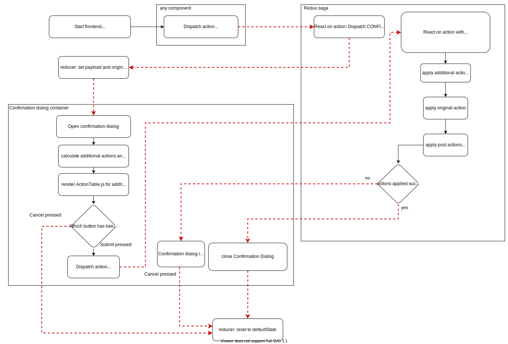

# Confirmation Dialog

The confirmation dialog is used to confirm an action or intent. When the confirmation dialog opens, it shows a dialog with "Cancel" and "Submit" button and a custom header and body.
Furthermore, the confirmation dialog can calculate all needed view and list permissions that are required for specific additional actions (e.g. if a new user is assigned to a workflowitem, the confirmation dialog shows all needed intents to provide the user the required permissions for the project, subproject and workflowitem to view the selected workflowitem) and specific pre-defined actions.

## Table of Contents

- [Confirmation Dialog](#confirmation-dialog)
  - [Table of Contents](#table-of-contents)
  - [Use cases](#use-cases)
  - [Workflow from user's point of view](#workflow-from-users-point-of-view)
  - [Advanced general workflow](#advanced-general-workflow)
    - [General description of the flow-chart](#general-description-of-the-flow-chart)
    - [Specific description of the flow-chart](#specific-description-of-the-flow-chart)
  - [Advanced workflow with additional and/or predefined actions](#advanced-workflow-with-additional-andor-predefined-actions)
    - [Description of the flow-chart](#description-of-the-flow-chart)
  - [Implement a new intent](#implement-a-new-intent)

## Use cases

The confirmation dialog should always be used for immutable actions (e.g. close actions)
The use cases for the confirmation dialog are:

- immutable actions (e.g. close actions)
- additional actions required (e.g. grant project and subproject view permissions for a new workflowitem assignee)
- pre-defined actions required (e.g. grant all permissions to a user after creating a workflowitem)
- display further information to the user (e.g. before disabling an user, show where the user is still assigned to)
- further information needed

## Workflow from user's point of view

The workflow of the confirmation dialog is always the same. Additional permissions (additional actions) and predefined permissions (post actions) are optional.

1. An action is triggered that may require to set additonal or predefined permissions.
2. Open the confirmation dialog and check if the grantee needs additional permission.
3. Display additional and/or predefined permission in a table if existing.
4. After the user submits, the additional permissions (if existing) are set first, then the requested action is executed, then the predefined permissions (if existing) are set
5. If one execution fails, the confirmation dialog stops and the user will be informed. All following actions are aborted. The user can only press cancel to exit the confirmation dialog.
6. If all actions are executed successfully, the confirmation dialog will be closed automatically.

A status icon shows if the action is not executed, is executed successfully or is failed. If an action fails to execute, all following actions will be aborted.

When all actions have been executed successfully, the confirmation dialog closes automatically (confirmation dialog reducer resets the state to defaultState).

When one action fails executing, the confirmation dialog keeps open and only the "cancel" button is clickable. After pressing "cancel", the confirmation dialog closes (confirmation dialog reducer resets the state to defaultState).

## Advanced general workflow

To understand the workflow of the confirmation dialog, you need to be familiar with the [redux state management](https://redux.js.org/) and the [redux saga](https://redux-saga.js.org/) (side effect management).

This flow-chart describes how the confirmation processes.

Hint: The yellow activties describe abstract scenarios. The exact scenario in this activites depend on the specific action that uses the confirmation dialog.

### General description of the flow-chart

1. When the frontend is rendered, the redux store of the confirmation dialog is set to defaultState. Per default, the confirmation dialog is closed.
2. In any component, an action starts to dispatch.
3. After the action is dispatched, the corresponding saga function starts to execute. In the saga function, the value of the state variable "confirmed" from the redux store is fetched. Since the redux store of the confirmations dialog is still set to the default state, the "confirmed" state variable is set to false. Hence, the corresponding saga function starts to dispatch the action "CONFIRMATION_REQUIRED" with the data of the original action and a payload. The saga function will cancel its execution itself.
4. When the action "CONFIRMATION_REQUIRED" is dispatched, the original action and the payload are stored to the redux state. Furthermore, the redux state variable "confirmationDialogOpen" will be set to "true".
5. After the state variable "confirmationDialogOpen" changes to true, the react component "Confirmation dialog container" is re-rendered and opens the confirmation dialog.
6. The confirmation dialog starts to process the content which depends on the original action and the payload that are stored in the redux state.
7. Now the user can decide to submit the action or to cancel the action.
   - If cancel button is pressed, reset the redux state to default state. The confirmation dialog closes because "confirmationDialogOpen" is set to false in the default state
   - If submit button is pressed, set the redux "confirmed" state variable to "true" and dispatch the same action as in 2. .
8. After the action is dispatched, the corresponding saga function starts to execute. In the saga function, the value of the state variable "confirmed" from the redux store is fetched. Since the redux "confirmed" state variable is set to true, the saga function starts to execute the action.
9. Now the action has been executed.
   - If the action failed, the confirmation dialog remains open to show the failed action. The user can press "cancel" to close the dialog.
   - if the action succeeded, the confirmation dialog will close itself by setting the redux state to default state.

### Specific description of the flow-chart

For better understanding, here is the description for the action "workflowitem.close".

1. When the frontend is rendered, the redux store of the confirmation dialog is set to defaultState. Per default, the confirmation dialog is closed.
2. Every workflowitem has an own close-button. If this button is clicked, the function "closeWorkflowItem" is executed and the action "CLOSE_WORKFLOWITEM" is dispatched.
3. The saga triggers and starts executing the generator function "closeWorkflowItemSaga". In this function, it checks the redux state variable "confirmed". Since "confirmed" is set to false, the saga starts dispatching the action "CONFIRMATION_REQUIRED" with the original action and the payload as parameters. The saga function will cancel its execution itself.
4. When the action "CONFIRMATION_REQUIRED" is dispatched, the original action and the payload are stored to the redux state. Furthermore, the redux state variable "confirmationDialogOpen" will be set to "true".
5. After the state variable "confirmationDialogOpen" changes to true, the react component "Confirmation dialog container" is re-rendered and opens the confirmation dialog.
6. The confirmation dialog shows the component "ActionTable". In this component, a table with information about the current action is displayed. So it shows the name of action(workflowitem.close), the type of the element (workflowitem), the name of workflowitem that we want to close, the name of the current user and a status icon.
7. Now the user can decide to submit the action or to cancel the action.
   - If cancel button is pressed, reset the redux state to default state. The confirmation dialog closes because "confirmationDialogOpen" is set to false in the default state.
   - If submit button is pressed, set the redux "confirmed" state variable to "true", the function "closeWorkflowItem" is executed and the action "CLOSE_WORKFLOWITEM" is dispatched.
8. After the action is dispatched, the saga triggers and the function "closeWorkflowItemSaga" starts to execute. In the saga function, the value of the state variable "confirmed" from the redux store is fetched. Since the redux "confirmed" state variable is set to true, the saga function starts to execute the action "workflowitem.close".
9. Now the action has been executed.
   - If the action failed, the confirmation dialog remains open to show the failed action. The user can press "cancel" to close the dialog.
   - if the action succeeded, the confirmation dialog will close itself by setting the redux state to default state.

## Advanced workflow with additional and/or predefined actions

This flow-chart describes how additional and pre-defined/post actions are handled. The workflow is the same as in the general workflow, however, there are a few more steps needed.

### Description of the flow-chart

This workflow is used for all intents that may require additional permissions and/or requires to set permission after executing the requested intent. For a better understanding, we use the intent "workflowitem.assign" to describe this workflow. This intent may need additional permission to ensure that the assignee has the required view permissions.

1. When the frontend is rendered, the redux store of the confirmation dialog is set to defaultState. Per default, the confirmation dialog is closed.
2. Every workflowitem has a dropdown to select an assignee. If the assignee is changed, the function "assignWorkflowitem" is executed and the action "ASSIGN_WORKFLOWITEM" is dispatched.
3. The saga triggers and starts executing the generator function "assignWorkflowitemSaga". In this function, it checks the redux state variable "confirmed". Since "confirmed" is set to false, the saga starts dispatching the action "CONFIRMATION_REQUIRED" with the original action and the payload as parameters. The saga function will cancel its execution itself.
4. When the action "CONFIRMATION_REQUIRED" is dispatched, the original action and the payload are stored to the redux state. Furthermore, the redux state variable "confirmationDialogOpen" will be set to "true".
5. After the state variable "confirmationDialogOpen" changes to true, the react component "Confirmation dialog container" is re-rendered and opens the confirmation dialog.
6. The confirmation dialog calculates the needed additional actions in "createAdditionalActions.js", based on original action and the permissions that the new assignee already owns. Then, the component "ActionTable" is rendered with the original and additional actions. In this component, a table with information about the current action is displayed.
   - If cancel button is pressed, reset the redux state to default state. The confirmation dialog closes because "confirmationDialogOpen" is set to false in the default state.
   - If submit button is pressed, set the redux "confirmed" state variable to "true". Then, the function "assignWorkflowitem" is executed and the action "ASSIGN_WORKFLOWITEM" is dispatched.
7. After the actions is dispatched, the saga triggers and the function "assignWorkflowitemSaga" starts to execute. In the saga function, the value of the state variable "confirmed" from the redux store is fetched. Since the redux "confirmed" state variable is set to true, the saga function starts to execute the additional actions first, then it executes the original action "workflowitem.assign".
8. Now the actions have been executed.
   - If an action failed, the confirmation dialog remains open to show the failed action. The user can press "cancel" to close the dialog.
   - if all actions succeeded, the confirmation dialog will close itself by setting the redux state to default state.

## Implement a new intent

To implement a new intent, it is mandatory to comply with the workflow from the [Advanced general workflow](##advanced-general-workflow)
Basically, following steps have to be done:

- Define an action with the business logic in reducer and the API request in the sagas.js.
- Define one action for a succeeded and one action for a failed API request and forward them to the confirmation dialog reducer.js.
- Implement the action "CONFIRMATION_REQUIRED" and the redux state variable "confirmed" to the saga function of your intent.
- Map your action and all needed redux state variables to ConfirmationContainer.js and forward these props to ConfirmationDialog.js.
- Implement the intent to ConfirmationDialog.js and define the confirmation dialog content. If necessary, create an extra component for the content of your confirmation dialog.
- If additional or post actions are needed (e.g. grant view permissions if necessary), define them in createAdditionalAction.js.
