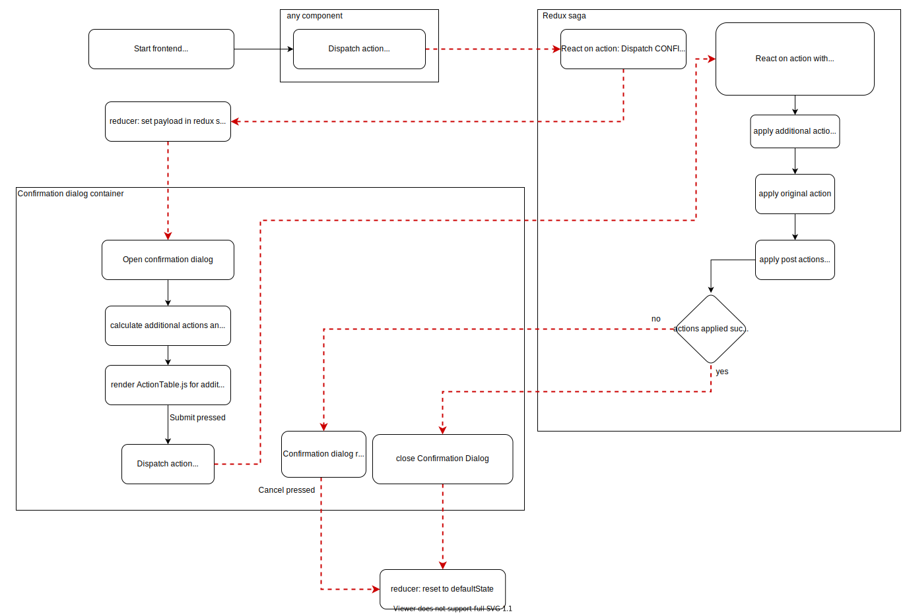

# Confirmation Dialog

The confirmation dialog is used to generate automatically all additional needed permissions and a set of pre-defined permissions for a specific intent (e.g. grant listPermission, set assignee, ...).

## Basic workflow

The workflow of the confirmation dialog is always the same. Additional permissions (additional actions) and predefined permissions (post actions) are optional.

1. An action is triggered that may require to set additonal or predefined permissions
2.
3. Open the confirmation dialog and check if the grantee needs additional permission
4. Display additional and/or predefined permission in a table if existing
5. After the user submits, the additional permissions (if existing) are set first, then the requested action is executed, then the predefined permissions (if existing) are set
6. If one execution fails, the confirmation dialog stops and the user will be informed. All following actions are aborted. The user can only press cancel to exit the confirmation dialog.
7. If all actions are executed successfully, the confirmation dialog will be closed automatically.

## Advanced workflow

<!-- Trigger confirmation dialog in saga - set payload with intent information
Open confirmation dialog:
Calculate additional - actions in createAdditionalActions.js,
Calculate post - actions in createPostActions.js

Show tables in the ConfirmationDialog.js in this Sequence:

1. Additional actions table (if existing)
2. Original Action table (always exists)
3. Post actions table (if existing)

Execute additional actions in executeAdditionalActions.js
Execute original actions in executeActions.js
Execute post actions in executePostActions.js

After pressing submit, the actions will be executed in this sequence. Thus, for each table of actions, it is neccassray to (1) check if it exists (if not, skip the current execution) and (2) to wait for completion (since postActions can only be executed after the originalAction).
To achieve a serial processing, each table of actions will distpatch an action in the saga after completion to set a boolean variable (isExecutionFinished) in reducer. If an action table does not exist, an action will be dispatched to set a boolean variable (isExecutionSkipped) in reducer. The next action table will be automatically executed (sideEffect, useEffect) if one of those condition is true (isExecutionFinished || isExecutionSkipped). -->

To understand the workflow of the confirmation dialog, you need to be familiar with the redux state management (action, reducer) and the redux side effect managemant (saga).

The workflow starts when a component dispatches an actions, where the reaction of the saga dispatches CONFIRMATION_REQUIRED action.

A status icon shows if the action is not executed, is executed successfully or is failed. If an action fails to execute, all following actions will be aborted.

When all actions have been executed successfully, the confirmation dialog closes automatically (confirmation dialog reducer resets the state to defaultState)

When one action fails executing, the confirmation dialog keeps open and only the "cancel" button is clickable. After pressing "cancel", the confirmation dialog closes (confirmation dialog reducer resets the state to defaultState)
