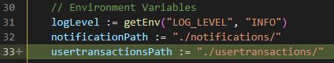
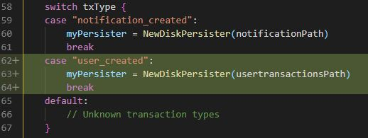

# Multichain-Feed

This project provides a script that can be passed to multichain's runtime variable `walletnotify` in the [blockchain project](https://github.com/openkfw/TruBudget/tree/main/blockchain) of Trubudget. The script is executed when a transaction is done. More information how `walletnotify` works can be found in the [runtime-parameter-list](https://www.multichain.com/developers/runtime-parameters/) of multichain.
The script checks the transaction type and executes sideEffects programmed for each recognized type.

## Transaction Types

All of Trubudget's events have a certain type. For each event a transaction is created on the blockchain. The multichain feed can perform side effects for specific transactions. An Example for a side effect is the notification_created transaction. On each notification_created transaction a file is saved locally. The different types can be found in Trubudget's [api project](https://github.com/openkfw/TruBudget/tree/main/api). In the [domain layer](https://github.com/openkfw/TruBudget/tree/main/api/src/service/domain#events) of the api all events which create transactions can be found.

The following list shows all recognized transactions with implemented side effects:

- notification_created

### Type: notification_created

This type of event/transaction defines the creation of one notification. The notification id and the recipient can be found in the event defined by Trubudget's api. The [notification_transaction_example.json](./examples/notification_transaction_example.json) file shows how the structure of such a transaction looks like.

#### Side Effect of notification_created

Saves the transactions as json file locally. Notification transactions are saved locally into the notifications directory as json files. The files have a timestamp as name. Details about all environment variables can be found in the [configuration section](https://github.com/openkfw/TruBudget/tree/main/blockchain#configuration) of the blockchain project.

## Add a new transaction type

New transaction and side effects are implemented in the GO project. Whenever a transaction occurs, the compiled GO binary will be executed. To add a new transaction, simply add the transaction type and the directory (path) to save the transaction as \*.json to `multichainFeed.go`.

### Example

As an Example, we want to log every transaction where a new user is created in a \*.json file. To achieve this, we need to do following:

1. Add `usertransactionsPath := "./usertransactions/"` to `multichainFeed.go`

   

2. Add the new transaction type `user_created` to `multichainFeed.go`

   

3. Set the environmental variables `MULTICHAIN_FEED_ENABLED` to `true` in `blockchain/.env`.

4. Go to the multichain-feed directory (/multichain-feed) and compile the GO project to a binary script file with `GOOS=linux GOARCH=amd64 go build .` Use different target OS and architecture, if you know what you're doing.

```bash
cd multichain-feed/
GOOS=linux GOARCH=amd64 go build .
```

5. Now copy the multichain-feed binary script into the docker container using following commands. The docker container name can be found with `docker ps`. A restart or rebuild is not required. You need to be in the multichain-feed directory (/multichain-feed).

```bash
docker cp multichain-feed blockchain_main-node_1:/home/node/src/multichain-feed/multichain-feed
```

## Testing

To test the multichainFeed.go

- Navigate into the root directory of the mutlichain-feed project.
- Build the go project.
- Execute the generated binary with a valid transaction

To test the current implemented transaction type `notification_created`, use following commands:

```bash
cd multichain-feed/
GOOS=linux GOARCH=amd64 go build .
./multichain-feed "$(cat ./examples/notification_transaction_example.json)"
```

To see the \*.json files in the running MutliChain, view inside the docker container and navigate to the the specific path, for example:

```bash
docker exec -it <containerid> bash
cd notifications
ls
cat <somefilename>.json
```
