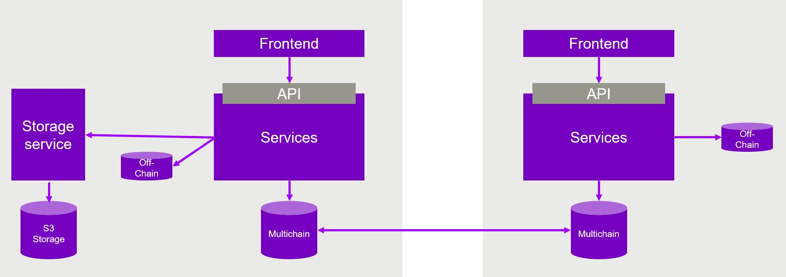
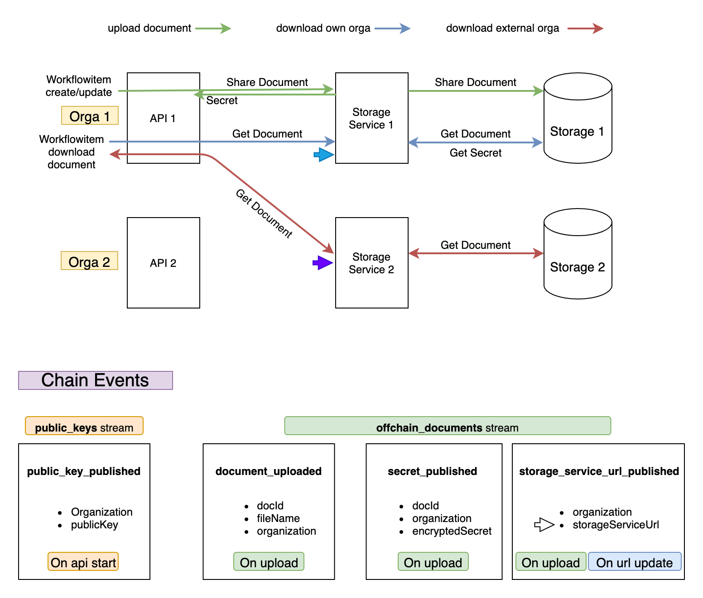

# Storage-Service

The storage service is responsible for saving/deleting/accessing documents to Minio, an external storage server.
It is an optional feature that allows TruBudget users to upload & download documents, while restricting the access to
the documents through TruBudget's permission system. If it is not enabled TruBudget will work without the document
feature.
In the future the storage-service can be extended to support other storage types. For now minio and Azure blob storage is supported.

## Getting Started

### Start with Docker

The easiest way to get started is to use our [`docker compose`](../docker-compose/) setup which starts the
whole TruBudget application including the storage-service.
Follow these steps to start the environment using docker:

```bash
cd docker-compose
cp .env.example .env
docker compose --project-directory . -f blockchain/docker-compose.alphanode.yml -f api/docker-compose.yml -f frontend/docker-compose.yml -f storage-service/docker-compose.yml up
```

The cluster contains:

- 1 Alpha-Node (Blockchain)
- 1 API connected to Alpha-Node
- 1 Frontend connected to API
- 1 Storage Service connected to API
- 1 Minio connected to Storage-Service

### Start without Docker

To start the storage-service without docker, you need to start all desired service yourself with the right environment
variables. To set these environment variables, read the documentation of the services in their folder or use the
.env.example file of the storage-service. We recommend to start Minio with docker since the configuration is much easier.
To start Minio without docker we refer to
their [official documentation](https://docs.min.io/docs/minio-quickstart-guide.html).

Follow this service start order to start the environment without docker (assuming minio is already started):

- Blockchain
- Api
- Frontend
- Storage Service (below for instructions)

```
cd storage-service
source .env.example
npm install
npm run build
npm start
```

### Endpoints

| Method | Endpoint   | Description                                    |
| ------ | ---------- | ---------------------------------------------- |
| GET    | /readiness | Checks if storage service (and minio is ready) |
| GET    | /liveness  | Checks if storage services is up               |
| GET    | /version   | Get the current version of the service         |
| GET    | /download  | Download a document (docId + secret needed)    |
| POST   | /upload    | Upload a document                              |

### Environment Variables

To be able to activate and configure the Storage Service, you need to set the relevant environment variables. More information on that and a list of available environment variables, see: [Environment Variables](./environment-variables.md)

## Architecture

Below you can see two nodes where the left one has the storage-service enabled. For a node with storage-service it is
only possible to save documents via storage-service.
The way the document upload event is saved on the blockchain decides where the document can be found.



### Document distribution

The enabled storage-service is used in Trubudget to prevent a node from sharing its documents without any restriction
among the blockchain network. This way documents are stored in a s3 storage connected to the storage-service and not
on-chain. On the blockchain only document ids, access-secrets and document download URLs are stored but not the actual
document data.
To share the document among the organizations in the network a special mechanism is used to only give organizations
access which really need the document access.

#### Distribution mechanism

The access of the documents are restricted by a secret generated by the storage-service of the storage the document is
saved in. To download a document from a storage-service three parts of information have to be known:

- Valid secret
- Document ID
- URL of storage-service
  These information are found on-chain. The document ID and the URL of the storage-service are shared between all nodes
  and can be read by any node in the network. The valid secret is saved encrypted instead and can only be accessed by
  specific organizations.
  To encrypt and decrypt this secret, RSA keypairs (public and private keys) are used. Every node in the network needs
  to share it's public key before connecting to a network. This is done on api startup.
  If a document should be uploaded for an organization, which is currently defined by the
  permissions `workflowitem.list`, the shared public key of this organization is used to encrypt the document's
  secret. The secret can only be read by the organization which provides the right private key.

But where is the private/public key pair coming from?
An organization creates it's own private key automatically to sign each transaction as organization. This private key is
shared encrypted with the `ORGANIZATION_VAULT_SECRET` in the organization-stream(`org:KfW`) on-chain. This private key
is used to generate the public key. This public key is shared via the `public_keys` stream.

How does Trubudget perform a document upload including the storage-service ?

1. The api has to be started with the external available URL of the storage-service - `STORAGE_SERVICE_EXTERNAL_URL`
1. A document upload is triggered via one of the intents `workflowitem.create` or `workflowitem.update`
1. The document is stored via storage-service onto the connected storage
1. A secret is generated and returned by the storage-service if the document was successfully stored
1. An document ID is generated by the api
1. The api has now all the information to access this document (secret, ID, URL) and must share these information via
   blockchain
1. In the image below you can see the documents stream including the streamitems/events which are used to share this
   information. (secret: `secret_published`, ID: `document_uploaded`, URL: `storage_service_url_published`)

How does Trubudget perform a document download including the storage-service?

1. A document download is triggered via `workflowitem.downloadDocument` api endpoint including a workfowitem ID and a
   documentId field which is the id generated by the api
1. The api checks the user's `workflowitem.list` permission
1. Next the api needs again all three parts of information: `secret`, `ID`, `URL`
1. ID: Is already passed via request parameter
1. URL: The api checks which organization has uploaded the document and get the external URL of its storage-service
1. secret: The api gets the secret which was published for the document ID and own organization
1. The api can now perform a document download using the external URL, the docId and secret
1. The document data is then forwarded to the requester


